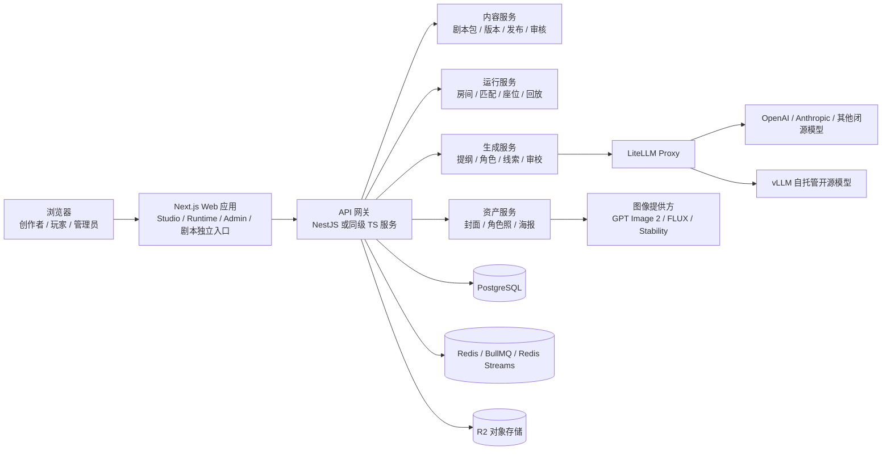
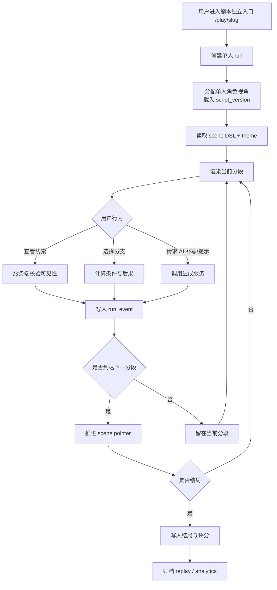
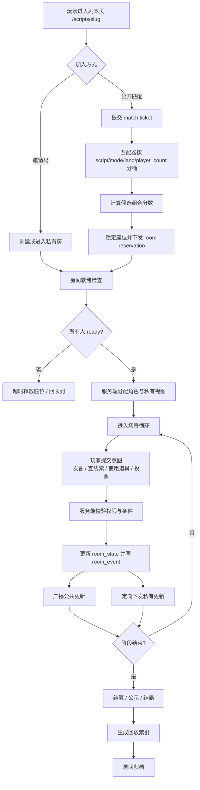

# 线上剧本杀创作与运行平台深度分析报告

## 执行摘要

这类平台最容易做错的地方，不是“模型选哪家”，而是没有把**内容层**、**运行层**、**资产层**和**模型层**拆开。对你这个项目，我的明确建议是：把“剧本创作与发布”做成一套版本化内容系统，把“单人/多人运行”做成一套服务端权威状态机，把“封面/角色照/海报”等素材做成异步资产流水线，再用独立的模型网关管理文本与图像模型。前端优先采用 Next.js App Router 承接创作者工作台、剧本独立入口页和玩家端；后端优先采用 TypeScript 主干服务，配 PostgreSQL、Redis、对象存储和任务队列，先做“模块化单体”，而不是一开始就上微服务。Next.js 官方已把 App Router、多租户、多分区部署、自托管这些路径作为一等能力来组织；NestJS 的定位也是可扩展的 Node.js 服务端应用框架。citeturn26view2turn18view3turn18view4

如果只选一条最稳的首发路线，我建议是：**Next.js + NestJS + PostgreSQL + Redis/BullMQ + R2 + LiteLLM + OpenAI GPT 文本模型 + GPT Image 2 或相似图像模型**。多人运行层建议采用**服务端权威房间**，首发用 Socket.IO 足够，后续当房间状态同步、匹配与跨进程扩展成为主矛盾时，再把 Runtime 单独拆成 Colyseus 服务；如果你未来特别在意全球低运维和边缘有状态协作，再评估 Cloudflare Durable Objects。Socket.IO 已提供连接状态恢复；Colyseus 原生强调权威游戏服务器、匹配与重连；Cloudflare Durable Objects 则提供全局唯一实例、强一致存储和 WebSocket Hibernation。citeturn15view2turn15view0turn15view1turn15view4turn15view5turn15view6

LLM 自动创作部分，不建议单次一口气生成完整剧本，而应采用**层次化生成**：先生成 premise 和 story bible，再生成角色矩阵、线索矩阵、分幕提纲，最后按段落/场景输出可执行剧本 DSL，并在每轮后做一致性检查与自我修订。这个思路和经典的 Plan-and-Write、Hierarchical Neural Story Generation、Self-Refine 都一致；工程上则用 Structured Outputs 保证 JSON Schema 正确，用 Function Calling/工具调用让语言模型自动触发画像生成、审校与审核工具。OpenAI 官方也明确建议在可行时优先使用 Structured Outputs，而不是只依赖 JSON mode；图像工具支持在 Responses API 中把文本模型和 image_generation 工具绑在一起使用。citeturn8search0turn8search7turn8search1turn14view1turn14view2turn14view3

成本上，文本生成最容易被控制，**最长尾的成本其实来自图片与多人实时运行**。OpenAI 官方当前列出的 GPT-5.4 mini 价格是输入 0.75 美元/百万 token、输出 4.50 美元/百万 token；Prompt Caching 可在命中前缀时显著降低输入成本和延迟，Batch API 可将异步任务成本再降一半。对象存储如果走 Cloudflare R2，标准存储是 0.015 美元/GB-month，且互联网出口免费；图像如果你需要固定单图预算，Black Forest Labs 与 Stability 的价格比 OpenAI 的 token 计费更容易做每张图预算控制。citeturn28view0turn14view4turn14view5turn16view0turn29view2turn31search0

隐私与上线可行性方面，建议默认把 OpenAI Responses 调用都设为 `store=false`，并把平台自己的“运行状态”和“创作状态”全存回你自己数据库，而不是依赖第三方 API 的应用状态保存。OpenAI 官方说明：API 数据默认不用于训练，滥用监控日志默认最多保留 30 天；符合条件的客户可申请 Zero Data Retention 或数据驻留，且日本、新加坡、韩国等区域已在可选范围内。上线前的底线安全栈应包括：CSP、CSRF 防护、RLS、审核日志、文件上传白名单和图文双模态审核。citeturn20view0turn20view1turn9search2turn24search3turn33search1turn9search3turn21view0

## 产品边界与总体方案

建议把平台拆成四个产品面：**创作者工作台**、**剧本独立展示页**、**玩家运行端**、**治理与运维后台**。这样做的关键收益是，创作、发布、运行、运维不会互相污染：创作者可以在 Studio 里写内容和主题；最终玩家看到的是已经发布冻结的 `script_version`；管理员管理的是剧本包、模型路由、审核与配额，而不是直接改在线房间。Next.js App Router 适合做“工作台 + 独立入口 + 运行页”这类同域多形态 Web 应用，因为它以文件系统路由、Server Components 和 Server Functions 为核心，同时官方已有多租户、自托管和多分区部署指引。citeturn26view2turn18view3



在产品建模上，我建议把“剧本”理解成**可执行内容包**，而不是一堆富文本页面。也就是说，平台内部的 canonical source 不应是任意 HTML，而应是**版本化的剧本 DSL**：包括角色、线索、分幕、触发条件、可见性规则、计时器、投票规则、胜负判定、主题皮肤与素材引用。渲染到 HTML 只是最后一步。这样你才能同时支持单人运行、多人运行、回放、观战、审核与版本回滚。对于“HTML 美化界面”和“UI/UX 美化面板独立化”，推荐采用“**内容 DSL + 主题 token + 预览渲染器**”三层，而不是把用户任意 HTML/CSS/JS 直接落到公共页面。后一种虽然灵活，但会把 XSS、脚本注入、样式污染和后期版本 diff 都放大。CSP 与 Next.js 官方的 CSP 指引，本质上也支持这种“默认不信任内联脚本”的思路。citeturn9search2turn25view3

下面这张表给出你列出的主要维度的推荐取舍。表中“推荐”是工程判断；涉及官方能力的地方，我在表后用官方文档集中标注依据。

| 维度 | 可选方案 | 优点 | 缺点 | 推荐 |
|---|---|---|---|---|
| 创作剧本 | 富文本编辑器；Markdown/MDX；JSON DSL | 上手快；可代码化；可执行性强 | 任意富文本难做流程逻辑；MDX 易把展示和逻辑耦合 | **JSON DSL 为主，Markdown/MDX 为辅** |
| HTML 美化界面 | 原始 HTML/CSS；组件化模板；主题 token | 灵活；复用好；安全/版本化更强 | 原始 HTML 安全成本最高 | **组件模板 + 主题 token** |
| Web 应用 | 纯 SPA；SSR/Hybrid Web；多端原生壳 | SPA 轻；SSR 适合独立入口和 SEO | 纯 SPA 对独立剧本入口和首屏不优 | **Next.js Hybrid Web** |
| 创作模板 | 文本片段模板；角色模板；完整剧本包模板 | 可复用；利于 LLM 检索增强 | 只做片段会导致拼接不一致 | **完整剧本包模板 + 片段模板双层** |
| LLM 按关键词生成剧情 | 单次直出；分层生成；检索增强生成 | 单次快；分层稳；RAG 可复用历史模板 | 单次一致性差；RAG 要治理素材库 | **分层生成 + 模板检索 + 自我修订** |
| 生成剧本照/角色照 | 直接图像 API；语言模型先写提示词再调用；自建图像工作流 | 闭环自动化好；成本易控 | 图像一致性与版权审核要额外做 | **语言模型生成提示词并自动调用图像模型** |
| 每个剧本独立入口展示 | 动态路由；子域名；自定义域 | 动态路由最省事；域名品牌更强 | 自定义域运维复杂 | **动态路由先行，自定义域后做** |
| 单人运行 | 素材叙事；伪实时分幕；AI 旁白增强 | 最容易验证内容质量 | 商业化留存未必最高 | **先做好“可恢复单人模式”** |
| 多人运行 | 邀请房；公开匹配；主持人房 | 邀请房稳定；公开匹配更有增长 | 公开匹配需要风控与守约度治理 | **邀请房 + 公共匹配并存** |
| 匹配与房间机制 | 纯邀请码；队列分桶；全游戏框架匹配 | 简单；可扩展；功能完整 | 简单方案后期难补课 | **队列分桶 + 座位保留 TTL** |
| 管理员/用户增删剧本 | 仅 RBAC；RBAC+审核；Marketplace | 上线快；平台治理好；可经营社区 | 治理能力越强，后台越重 | **RBAC + 审核 + 版本冻结** |
| 模型管理与路由 | 直连 SDK；统一网关；自托管兼容层 | 简单；可切换；能降本 | 直连耦合重；自托管维护高 | **LiteLLM 网关 + 可选 vLLM** |
| 图像模型接入 | OpenAI；BFL；Stability；自建 | 质量/成本/可控性各有侧重 | 供应商差异会进入业务层 | **Provider Adapter 抽象层** |
| 剧本分段与脚本化 | 散文式文本；章节树；可执行 scene DSL | 章节树可读；DSL 可运行 | 自由文本无法驱动游戏机理 | **scene DSL** |
| UI/UX 美化面板独立化 | 与剧本同编辑器；独立主题工作台 | 统一简单；职责分离更清晰 | 同编辑器后期会杂乱 | **独立主题工作台** |
| 部署与扩展性 | 单体；模块化单体；微服务/边缘化 | 单体快；模块化稳；微服务弹性大 | 过早微服务成本高 | **模块化单体起步** |
| 安全与隐私 | 基础鉴权；分层安全；企业级数据控制 | 低成本；可上线；合规可卖 B 端 | 层级越高越复杂 | **分层安全，保留企业级升级口** |
| 成本估算 | 同步调用；缓存/批处理；预算路由 | 易实现；降本明显；可控最好 | 只做同步调用很快失控 | **Prompt Caching + Batch + Budget Routing** |

和上表直接相关的官方能力主要包括：Next.js 的 App Router、多租户、多分区与自托管路线；OpenAI 的 Structured Outputs、Function Calling、image_generation 工具、Prompt Caching、Batch、Prompt 对象与数据控制；LiteLLM 的路由、回退和预算；vLLM 的 OpenAI 兼容服务；以及 Colyseus、Socket.IO、Cloudflare Durable Objects 的实时房间能力。citeturn26view2turn18view3turn14view1turn14view2turn14view3turn14view4turn14view5turn23view0turn20view0turn14view6turn14view7turn14view8turn15view0turn15view2turn15view5

## 关键实现路径与系统设计

最稳妥的工程策略，是**前台与后台一套 Web 壳，内容与运行一套后端，生成与资产一套异步流水线**。前端层建议用 Next.js App Router：`/studio/*` 做创作者工作台，`/scripts/[slug]` 做剧本独立展示页，`/play/[slug]` 做单人入口，`/rooms/[roomId]` 做多人运行页。这样每个剧本都天然有独立入口，同时又不需要为每个剧本部署单独应用；如果以后要支持“作者子域名”或“剧本独立域”，可以沿着官方的 multi-tenant 与 multi-zones 路线演进。citeturn26view0turn26view1turn26view2

后端层建议从**模块化单体**起步，而不是一开始拆十几个服务。具体可以是一个主 API 服务，内部按模块组织为：`content`、`publication`、`runtime`、`matchmaking`、`assets`、`generation`、`model-router`、`audit`。如果你用 NestJS，这种模块组织会比较顺手，因为它本身强调可测试、可扩展、可维护的 Node 架构；如果你的团队擅长 Python，则可让“生成 worker”单独用 FastAPI，但不要把实时房间也放进去。FastAPI 很适合做后台任务与 WebSocket 示例服务，但在多人房间、SDK 统一和前后端 TypeScript 共享类型这件事上，TS 主干更省团队摩擦。citeturn18view4turn18view0turn18view1

数据库层推荐以 **PostgreSQL 为主**。原因不是“流行”，而是它正好覆盖你这个平台的三类数据：一类是关系型业务数据，如用户、组织、剧本包、房间、订单与审核；一类是半结构化内容，如场景 DSL、主题 token、生成参数、模型输出草稿，适合放 `jsonb`；第三类是检索数据，如剧本标题、标签、设定和模板检索，既能用 PostgreSQL Full Text Search，也可以在需要时叠加 pgvector。PostgreSQL 官方文档明确支持 `jsonb`、全文检索和行级安全策略；pgvector 也提供 HNSW、IVFFlat 等索引路线。citeturn33search0turn16view4turn33search1turn16view3

缓存与事件层建议统一用 **Redis**。但要特别强调：**不要把 Redis Pub/Sub 误当成可回放的房间事件总线**。Redis 官方文档说明，Pub/Sub 是 at-most-once 语义，订阅端掉线时消息会永久丢失；需要更强交付保障时，应转向 Redis Streams，而 Streams 本身就是 append-only log，并支持 consumer groups。对你来说，正确范式是“**房间热状态放内存/Redis，房间事件放 Streams 或数据库事件表，关键快照定时持久化**”。这样你才能同时解决断线补发、回放、观战延迟流与运营复盘。citeturn17view1turn3search10turn15view3

异步任务层，首发推荐 **BullMQ**。原因很现实：你大概率会先走 TypeScript 主干，而 BullMQ 天然就是 Node 端的 Redis 队列；它提供全局速率限制，而且对于图像生成、批量审校、封面裁切、审核回调这类任务已经足够。只有当你出现“一个工作流跨数小时甚至数天，并且还要支持人工审核、撤回、补偿、信号更新”的需求时，再引入 Temporal；Temporal 的价值在于 durable execution，而不是替代普通队列。Celery 也能做分布式任务，但更适合 Python 主栈。citeturn17view2turn34search0turn34search4turn34search3

模型接入层不要把供应商 SDK 直接埋进业务代码，而是做一层 **Model Router**。推荐方案是 LiteLLM 作为统一入口，前接 OpenAI 等闭源 API，后接 vLLM 这类自托管开源模型服务。LiteLLM 官方明确支持多提供商/多部署的负载均衡、回退、超时、重试和预算路由，并可借助 Redis 跟踪用量与冷却；vLLM 则提供 OpenAI 兼容 HTTP 服务，所以你的业务代码可以继续使用 OpenAI 风格客户端，大幅降低将来把某些任务迁到本地模型的成本。citeturn14view6turn14view7turn14view8

对于图片链路，我建议把“语言模型写提示词”和“图像模型生成角色照/封面图”做成**强绑定流水线**。在 OpenAI 路线里，推荐优先理解两种接法：如果你只需要“一次请求生成一张或几张图”，用 Image API；如果你要让语言模型先理解角色设定再决定何时生成图，优先用 Responses API 挂载 `image_generation` 工具。OpenAI 官方图像文档明确说明，Responses API 中真正填在 `model` 字段里的是文本主模型，而图像生成由托管的 image_generation 工具完成；同时 GPT Image 2 支持 `size`、`quality`、`format`、`compression` 等输出控制。citeturn14view3turn27view2turn27view1

实现顺序上，我建议先做出下面这条最短闭环：

| 阶段 | 交付目标 | 前后端与基础设施落点 |
|---|---|---|
| 首发内核 | 剧本包创建、版本保存、独立入口页、单人运行 | Next.js Studio/Play、API、PostgreSQL、R2 |
| 首发增强 | 关键词生成提纲、角色照/封面图、审核队列 | Generation Worker、LiteLLM、OpenAI/BFL/Stability、BullMQ |
| 多人起步 | 邀请房、就绪检查、断线重连、事件回放 | Runtime 服务、Socket.IO、Redis Streams、房间快照 |
| 公共匹配 | 匹配队列、守约度、观战、赛后回放 | Matchmaking 模块、记分规则、风控 |
| 平台化 | 用户发布、管理员审核、模板市场、模型预算 | 审核后台、发布工作流、Langfuse/提示词版本、预算路由 |

如果你只想做一个“能发布、能跑、能复用、能扩容”的首版，这个顺序比先追求 AI 复杂度更对。因为平台真正的护城河不是“第一版就能自动写多神的本”，而是**剧本包格式稳定、运行层稳定、发布和回放稳定**。

## 单人模式与多人模式运行设计

单人模式我建议先做成**可持久恢复、可多结局分支、可审计的剧情运行器**。也就是说，用户每推进到一个分段，就把“当前场景、角色视图、已解锁线索、选择分支、计时器状态、AI 生成补充内容引用”写成一次事件或快照。这样用户切设备、刷新页面、下线后回来，都能继续。单人模式最适合验证你的 DSL 是否合理，因为它不受匹配与房间治理干扰。技术上，不要把单人状态寄托在第三方对话 API 的应用状态上；OpenAI 数据控制文档已经说明，Responses API 默认会有 30 天应用状态保留，只有在 `store=false` 或开通更强数据控制后才会更接近“无状态调用”。平台运行状态应优先保存在你自己的库里。citeturn20view0



多人模式则必须是**服务端权威状态机**。原因很简单：剧本杀不是聊天室，房间里存在“角色私有信息”“阶段切换”“隐藏线索”“投票结果”“时间窗口”“行动权限”等严格规则。只要你把这些规则下放给前端，作弊、穿模、并发冲突、断线补状态都会一起长出来。无论你最终选 Socket.IO 还是 Colyseus，房间都应在服务端维护一个 `room_state`，客户端只提交“意图”，不提交“结果”。Colyseus 天然强调权威状态同步、匹配和重连；Socket.IO 则适合你把它嵌入更大的业务 API 服务里。对剧本杀这类以业务规则为主、物理同步极弱的产品，我更建议**首发用 Socket.IO + 自定义房间状态机**，后续如果房间数量、规则复杂度和跨进程同步压力明显增大，再把 Runtime 层独立出来上 Colyseus。citeturn15view0turn15view1turn15view2



匹配算法不建议一开始搞“复杂 Elo”。剧本杀的关键约束首先不是强竞技，而是**同脚本、同人数、同语言、时长偏好、完成意愿、网络稳定度**。更实用的做法是二层模型：先做**硬条件分桶**，再做**软评分组队**。硬条件建议至少包括：脚本 ID、模式（单人/多人/主持人房）、语言、目标人数、是否允许中途观战。软评分建议包括：等待时长、预估完成率、网络稳定度、设备类型、历史爽约率、是否新手、是否接受 AI 替补。一个简单但有效的分数函数可以写成：

```text
score(group) =
  w1 * avg_wait_time
+ w2 * preference_similarity
+ w3 * completion_rate
+ w4 * network_stability
- w5 * no_show_risk
```

随着等待时间增加，逐步扩大可接受偏差窗口。例如等待 30 秒后放宽“经验等级”；等待 60 秒后允许“时长偏好”轻微偏差；等待 90 秒后弹出“是否接受 AI 角色/转单人体验”的兜底选项。这样既不会一开始就把匹配搞得太硬，也不会让用户无止境挂队列。

房间管理建议采用下面这套状态机：`draft -> matching -> reserved -> ready -> loading -> playing -> paused -> finished -> archived`。其中 `reserved` 非常关键，因为它解决公共匹配里“抢到人但没准备好”的问题。推荐做法是：匹配成功后给每个座位一个 60~120 秒的 reservation TTL；过期未确认则释放座位、回滚组队。房间内部不要有“P2P 主持人”。服务端就是唯一主持权威，前端只拿“自己看得见的子状态”。

作弊防护要分为**信息泄露防护**和**行为作弊防护**。前者是剧本杀的核心：私有线索、角色卡、隐藏剧情、未公开投票结果，必须按 server-side visibility rule 下发，前端永远拿不到不属于它的数据。后者包括：所有行动必须带房间版本号或阶段戳；服务端验证行动窗口与角色权限；投票和关键选择写操作必须幂等；素材导出、复制、截图无法完全禁止，但可以加用户水印、房间水印、下载频率限制与赛后延时开放策略。安全层面，原始 HTML/素材上传必须有限制：只允许白名单扩展名、重命名文件、限制大小与 MIME、存放在 Web 根外或对象存储中，并保留举报与人工复核通道。citeturn9search3turn24search3turn9search2

断线重连建议采用“双保险”：第一层是实时框架自身的恢复能力，第二层是你的事件日志补发。Socket.IO 官方文档明确说，连接状态恢复可以恢复 socket 的房间与部分丢失包，但并不保证永远成功，所以应用仍需要在恢复失败时同步全局状态；Colyseus 也是类似逻辑，服务端允许重连并指数退避重试。工程上建议给每个玩家一张短期重连票据，并在房间维持 2~5 分钟的 grace period；若期间重连成功，则从最近快照 + 增量事件补齐。快照粒度可以定为“每个阶段结束一次 + 每 N 条事件一次”。citeturn15view2turn15view1turn15view3

观战与回放方案最好建立在**event sourcing** 上，而不是聊天室消息记录上。实时层可以用 Redis Streams 作为在线增量日志，最终权威归档写入 `room_event` 表。观战用户不应直接进入与玩家同级的私有频道，而应进入一个专门的 spectators 视图：默认延迟 30~60 秒，只显示公共信息，不下发私有线索与秘密投票。回放则读取快照与事件流重放 UI；对竞技性更强的玩法，可以只在房间结束后开放，或者开放“匿名回放”“裁判回放”“当事人全量回放”三档权限。Redis 官方说明 Pub/Sub 是 at-most-once，而 Streams 是 append-only log 并支持更强的消费语义，所以回放与补发不要押在 Pub/Sub 上。citeturn17view1turn3search10

如果你未来希望把多人房间尽量运维化简，Cloudflare Durable Objects 是值得保留的扩展路线。它提供全局唯一对象、强一致存储，并且 WebSocket Hibernation 能在空闲时休眠连接而不立刻断开，适合“少算多连”的房间型应用。但首发我仍不建议直接绑定它，因为你还需要先打磨剧本 DSL、审核、版本管理和模型链路，而这些比“把房间跑到边缘”更决定产品成败。citeturn15view4turn15view5turn15view6

## LLM 自动创作与剧本包体系

从生成质量看，线上剧本杀最不适合的策略，就是“给用户几个关键词，然后单次生成完整剧本”。长文本一致性、角色动机闭环、线索分配公平性、投票结局逻辑，都会在 single-shot 方案里迅速崩掉。更合理的路线，是把自动创作拆成五段：**题材约束与风格圣经**、**角色矩阵与秘密矩阵**、**分幕提纲**、**场景脚本 DSL**、**审校与素材生成**。这和 Plan-and-Write 的“先计划再生成”、Hierarchical Story Generation 的“先 premise 再 passage”、Self-Refine 的“生成—反馈—修订”是一条线上的。citeturn8search0turn8search7turn8search1

工程上，推荐把整个生成工作流做成下面这样的层次：

| 生成阶段 | 输入 | 输出 | 推荐模型策略 |
|---|---|---|---|
| 题材建模 | 关键词、年代、题材、人数、时长、禁用元素 | `story_bible` | 低成本文本模型，Structured Outputs |
| 角色矩阵 | `story_bible`、目标人数 | 角色设定、秘密、关系图 | 低成本文本模型 |
| 线索矩阵 | 角色矩阵、案件真相 | 线索列表、可见性、解锁条件 | 低成本文本模型 |
| 分幕提纲 | `story_bible`、角色矩阵、线索矩阵 | acts/scenes/phase plan | 低成本文本模型 |
| 场景脚本 | scene outline + constraints | `scene DSL` | 低成本模型分段生成 |
| 一致性修复 | 全局索引 + 场景 DSL | 修订建议、冲突列表、自动修复 | 强模型做终审 |
| 图像素材 | 角色设定/场景设定 | cover / portraits / clue art | 语言模型先写提示词，再调图像模型 |

这里最关键的两个技术点，是 **Structured Outputs** 和 **Function Calling**。前者解决“输出必须是合法并符合 schema 的 JSON”；后者解决“模型生成完设定后，自动调用 `generate_cover_art`、`generate_portrait`、`moderate_asset`、`save_scene_version` 之类的工具”。OpenAI 官方文档对这两点都讲得很明确：Structured Outputs 比 JSON mode 更可靠，因为它约束 schema；Function Calling 允许模型以 JSON schema 定义的函数调用访问你的工具和数据。citeturn14view1turn14view2

建议把你的创作 Prompt 拆成**稳定前缀**和**变量后缀**。稳定前缀写死平台风格、世界观约束、输出 schema、线索公平性规则、禁忌内容规约、字数与阶段限制；变量后缀只放用户当前输入，例如“赛博上海、四人短本、90 分钟、悬疑不恐怖、至少两个反转”。这样做有两个好处：第一，Prompt 更容易版本化与评测；第二，OpenAI 的 Prompt Caching 只对**完全一致的前缀**命中，所以把静态规则放在开头，才能真正吃到缓存和低延迟收益。citeturn23view0turn14view4

一个可用的 Prompt 模板，可以长这样：

```text
系统提示词（稳定前缀）
你是“剧本杀内容引擎”。
目标：生成可执行的 scene DSL，而非纯文学文本。
必须满足：
- 输出 JSON，严格符合给定 Schema
- 保证每个角色都有公开目标、隐藏目标、可触发行动
- 保证线索分配公平，不出现无解或单角色必胜
- 每个 scene 必须包含：phase / entry_if / visible_to / actions / reveals / timer / win_rule_hooks
- 禁止输出未成年人性内容、仇恨、血腥细节、违法教程
- 对不确定内容返回 needs_review=true

用户变量（后缀）
题材={{genre}}
关键词={{keywords}}
人数={{player_count}}
预计时长={{duration_minutes}}
风格={{tone}}
禁用元素={{banned_elements}}
```

在“角色设定、线索分配、胜负判定逻辑”三件事上，我建议严格结构化，而不是自由发挥。角色至少要有：`public_profile`、`private_secret`、`goal_public`、`goal_hidden`、`core_relationships`、`knowledge_scope`。线索至少要有：`clue_type`、`owner_scope`、`unlock_condition`、`truth_weight`、`misleading_score`。胜负判定不要写成长篇说明，而要写成**可执行规则钩子**，例如“个人目标完成 + 团队真相推进 + 特殊隐藏目标触发”的加权模型。这样才方便多人服和单人 AI 补写共享同一个运行内核。

图像生成部分，建议把“提示词生成”和“出图调用”做成一个流水线，而不是让创作者自己来回切。OpenAI 在 Responses API 中已经支持 `image_generation` 工具，模型可以在对话里自动决定何时生成图，并返回 base64 图像结果；如果你希望强制走出图，也可以固定 `tool_choice`。另外，OpenAI 的图像指南明确指出：在 Responses API 中不要把 `gpt-image-2` 直接填入 `model` 字段，而是要用文本主模型 + `image_generation` 工具；而在 Image API 中则可以直接指定 `model="gpt-image-2"`。citeturn14view3turn27view0

关于图像规格，角色照通常优先用竖图，封面优先横图。GPT Image 2 官方支持的 `size` 包括 1024×1024、1536×1024、1024×1536、2048×2048、3840×2160 等，并要求边长是 16 的倍数、长宽比不超过 3:1；`quality` 有 `low/medium/high/auto`。这非常适合你把“角色照”“封面图”“线索图”做成三套默认规格。一个必须提前知道的限制是：**GPT Image 2 目前不支持透明背景**。如果你的角色卡需要人物抠图感，建议要么后置背景移除工序，要么在图像提供方适配层里准备别家 provider 作为 fallback。citeturn27view1turn27view3

如果你要做“提示词治理”，有两条路。第一条是 OpenAI 原生 Prompt 对象，它支持长生命周期 prompt、版本、变量和回滚，适合单一供应商场景；第二条是 Langfuse，它把 prompt management、版本标签、dataset、experiment 和 trace 绑在一起，更适合你这种**未来大概率多模型、多供应商、多版本评测**的平台。我的建议是：**业务 prompt 统一用 Langfuse 管理，关键供应商特定 prompt 再镜像到 OpenAI prompt objects**。OpenAI Prompting 文档和 Langfuse 文档都强调了 prompt 的版本化和变量化；Langfuse 还把 eval 数据集和实验比较放在一套体系里。citeturn23view0turn22view0turn22view1

对于图像模型提供方，我建议在抽象层保留至少三类接入：

| 模型策略 | 优点 | 缺点 | 适用建议 |
|---|---|---|---|
| OpenAI GPT Image 2 | 和语言模型/工具调用闭环最好；提示词自动优化 | 当前按 token/工具流程估算预算更复杂 | **首选自动化闭环** |
| Black Forest Labs FLUX | 单图价格更直观；便于做固定预算 | 需要单独供应商接入与监控 | **草稿图与批量角色照备选** |
| Stability API | 价格清晰，适合大量“够用就行”的资产图 | 风格和一致性要自己打磨 | **便宜批量图方案** |
| 自建图像工作流 | 成本上限可控，风格链路最可定制 | 运维最重 | **后期再评估，不建议首发** |

就“剧本包/模板”体系而言，我建议用“数据库为真源 + 可导出包”为最佳平衡。也就是说，编辑时所有内容都落在数据库里；发布时，将当前 `script_version` 导出成一个可复用的包结构，便于复制、模板化、版本审计和跨环境迁移。推荐包结构如下：

| 包内对象 | 作用 |
|---|---|
| `manifest.json` | 包 ID、版本、作者、兼容性、标签、封面、依赖 |
| `roles.json` | 角色公开信息、隐藏信息、关系图 |
| `clues.json` | 线索清单、可见性、解锁条件 |
| `scenes/*.json` | 每个场景的可执行 DSL |
| `rules.json` | 胜负判定、计分、投票规则、时间规则 |
| `theme.json` | UI 主题 token、卡片样式、配色、字体引用 |
| `assets/` | 封面图、角色照、线索图、音效等静态资源 |
| `changelog.md` | 版本说明、修订历史 |
| `review.json` | 审核状态、风险标签、人工备注 |

发布与版本管理上，建议采用“**草稿可变，已发布版本不可变**”。一个 `script_package` 代表逻辑身份，一个 `script_version` 代表具体冻结快照。用户可以继续编辑新的 draft version，但已发布 `v1.2.0` 不能被原地修改，只能克隆为 `v1.2.1-draft`。回滚时只需要把 `stable_alias` 指回旧版本即可。这种做法和 OpenAI 的 Prompt 版本、Langfuse 的版本与 label 思路是一致的，只不过你把它用于“内容包”而不是“prompt”。citeturn23view0turn22view0

## 数据模型与关键接口

数据模型建议分为四组：**身份权限**、**内容版本**、**运行回放**、**模型治理**。下面这张表给出够你做第一版的核心表。PostgreSQL 可用 `jsonb` 存 scene DSL 与主题对象，用全文检索支持模板搜索，用 RLS 保证“用户只能改自己的包/团队内共享包”，后续再视情况接 pgvector 做模板近义检索。citeturn33search0turn16view4turn33search1turn16view3

| 表名 | 关键字段 | 说明 |
|---|---|---|
| `org` | `id`, `name`, `plan`, `status` | 组织/团队 |
| `user_account` | `id`, `email`, `display_name`, `status` | 用户主体 |
| `org_member` | `org_id`, `user_id`, `role`, `joined_at` | 团队成员与权限 |
| `script_package` | `id`, `org_id`, `owner_user_id`, `slug`, `title`, `genre`, `status`, `current_stable_version_id` | 剧本逻辑身份 |
| `script_version` | `id`, `package_id`, `semver`, `base_version_id`, `state`, `manifest_jsonb`, `theme_jsonb`, `created_by`, `published_at` | 版本快照 |
| `script_role` | `id`, `version_id`, `role_code`, `public_profile_jsonb`, `private_secret_jsonb`, `goal_jsonb` | 角色定义 |
| `script_clue` | `id`, `version_id`, `clue_code`, `visibility_rule_jsonb`, `unlock_rule_jsonb`, `content_jsonb` | 线索定义 |
| `script_scene` | `id`, `version_id`, `scene_code`, `phase`, `order_no`, `scene_jsonb` | 分段/场景 DSL |
| `media_asset` | `id`, `org_id`, `provider`, `kind`, `mime`, `storage_key`, `meta_jsonb`, `review_status` | 封面/角色照/线索图 |
| `publication_record` | `id`, `version_id`, `channel`, `status`, `reviewer_id`, `review_note`, `published_url` | 发布记录 |
| `match_ticket` | `id`, `user_id`, `script_package_id`, `mode`, `desired_player_count`, `lang`, `status`, `score_features_jsonb`, `expires_at` | 匹配票据 |
| `room` | `id`, `script_version_id`, `mode`, `status`, `seat_count`, `host_type`, `snapshot_version`, `started_at`, `ended_at` | 房间主体 |
| `room_seat` | `id`, `room_id`, `seat_no`, `user_id`, `role_id`, `ready_state`, `reconnect_token`, `reservation_expire_at` | 座位与角色占用 |
| `room_event` | `id`, `room_id`, `seq_no`, `event_type`, `actor_user_id`, `visibility_scope`, `payload_jsonb`, `created_at` | 回放与审计事件流 |
| `room_snapshot` | `id`, `room_id`, `seq_no`, `state_jsonb`, `created_at` | 房间快照 |
| `generation_job` | `id`, `version_id`, `job_type`, `input_jsonb`, `output_jsonb`, `provider_route`, `cost_estimate`, `status` | 生成任务 |
| `llm_provider` | `id`, `name`, `api_base`, `status`, `budget_daily`, `priority` | 模型提供方配置 |
| `llm_model` | `id`, `provider_id`, `model_name`, `capability_tags`, `rpm_limit`, `tpm_limit`, `unit_cost_jsonb` | 模型与能力清单 |
| `prompt_template` | `id`, `name`, `scope`, `version`, `body`, `schema_jsonb`, `status` | 平台内部 Prompt 模板 |
| `moderation_record` | `id`, `target_type`, `target_id`, `provider`, `result_jsonb`, `flagged`, `review_status` | 文本/图片审核 |
| `audit_log` | `id`, `actor_id`, `target_type`, `target_id`, `action`, `diff_jsonb`, `created_at` | 管理操作审计 |

如果你想把 `script_scene.scene_jsonb` 设计得以后不返工，我建议它至少包含这些字段：

```json
{
  "scene_code": "act2_interrogation",
  "phase": "investigation",
  "title": "第二幕：审问",
  "entry_if": ["flags.intro_finished == true"],
  "visible_to": ["seat:1", "seat:2", "moderator"],
  "timer_sec": 900,
  "public_text": "众人进入审问阶段。",
  "private_panels": [
    {
      "target": "role:detective",
      "content": "你注意到窗台上有新的划痕。"
    }
  ],
  "actions": [
    {
      "code": "inspect_window",
      "label": "检查窗台",
      "allow_if": ["inventory.has('gloves') == true"],
      "effect": [{"type": "reveal_clue", "clue_code": "C-12"}]
    },
    {
      "code": "start_vote",
      "label": "发起投票",
      "allow_if": ["timer.remaining <= 120"]
    }
  ],
  "end_if": ["all_required_clues_revealed == true", "timer.expired == true"],
  "win_rule_hooks": ["team.truth_progress += 20"]
}
```

这类结构比“在富文本里写说明”重要得多，因为它直接决定你的运行器是否可验证、可回放、可观战、可审计。

关键接口建议按“内容域、运行域、生成域、治理域”组织。下面给出第一版最关键的一组：

| 方法 | 路径 | 作用 |
|---|---|---|
| `POST` | `/api/script-packages` | 创建剧本包 |
| `POST` | `/api/script-packages/{id}/versions` | 从当前稳定版或模板创建新版本 |
| `PUT` | `/api/script-versions/{id}/scenes/{sceneCode}` | 保存场景 DSL |
| `POST` | `/api/script-versions/{id}/generate-outline` | 根据关键词生成 premise/大纲 |
| `POST` | `/api/script-versions/{id}/generate-assets` | 批量生成封面/角色照 |
| `POST` | `/api/script-versions/{id}/publish` | 提交发布审核 |
| `POST` | `/api/rooms` | 创建邀请码房间 |
| `POST` | `/api/matchmaking/tickets` | 提交公共匹配票据 |
| `POST` | `/api/rooms/{roomId}/ready` | 玩家就绪 |
| `POST` | `/api/rooms/{roomId}/actions` | 提交游戏行动 |
| `GET` | `/api/rooms/{roomId}/replay` | 获取回放索引 |
| `POST` | `/api/admin/model-routes/test` | 测试模型路由与预算 |

下面给出几组推荐的请求/响应示例。

**创建剧本包**

```json
POST /api/script-packages
{
  "title": "雾港失踪案",
  "slug": "fog-harbor",
  "genre": "悬疑推理",
  "default_player_count": 4,
  "tags": ["近未来", "港口", "短本"],
  "visibility": "private"
}
```

```json
201 Created
{
  "id": "pkg_01JV...",
  "slug": "fog-harbor",
  "status": "draft",
  "current_stable_version_id": null
}
```

**按关键词生成剧情提纲**

```json
POST /api/script-versions/ver_01JV.../generate-outline
{
  "keywords": ["近未来港口", "失踪", "记忆篡改"],
  "player_count": 4,
  "duration_minutes": 120,
  "tone": "冷峻悬疑",
  "banned_elements": ["血腥描写", "校园未成年人"],
  "template_strategy": "retrieve_and_blend"
}
```

```json
202 Accepted
{
  "job_id": "job_01JW...",
  "status": "queued",
  "next_webhook_event": "generation.completed"
}
```

**批量生成角色照**

```json
POST /api/script-versions/ver_01JV.../generate-assets
{
  "tasks": [
    {
      "kind": "portrait",
      "role_code": "detective",
      "style_pack": "neo-noir-v1",
      "provider_policy": {
        "primary": "openai",
        "fallback": ["bfl", "stability"]
      }
    },
    {
      "kind": "cover",
      "size": "1536x1024",
      "quality": "high"
    }
  ]
}
```

```json
202 Accepted
{
  "job_batch_id": "batch_01JW...",
  "tasks": [
    {"task_id": "ast_01", "status": "queued"},
    {"task_id": "ast_02", "status": "queued"}
  ]
}
```

**多人房间行动提交**

```json
POST /api/rooms/room_01JX.../actions
{
  "client_seq": 18,
  "action_code": "inspect_window",
  "args": {
    "target_scene": "act2_interrogation"
  },
  "room_version": 42
}
```

```json
200 OK
{
  "accepted": true,
  "room_version": 43,
  "public_delta": [
    {"type": "toast", "text": "有人检查了窗台。"}
  ],
  "private_delta": [
    {"type": "reveal_clue", "clue_code": "C-12"}
  ]
}
```

**WebSocket 事件约定**

| 方向 | 事件名 | 说明 |
|---|---|---|
| C → S | `room.join` | 进入房间并附重连票据 |
| C → S | `room.ready` | 玩家就绪 |
| C → S | `room.action` | 提交行动 |
| S → C | `room.state.patch` | 房间公共状态补丁 |
| S → C | `room.private.patch` | 私有信息补丁 |
| S → C | `room.phase.changed` | 阶段变化 |
| S → C | `room.replay.available` | 回放索引可用 |
| S → C | `room.recover.required` | 触发全量补状态 |

运维上，建议对 `room_event.seq_no`、`room.room_version`、`client_seq` 做严谨校验，并给所有影响状态的接口加幂等键。因为多人运行里真正可怕的问题，不是 WebSocket 掉线，而是**重复提交、乱序提交和角色私有信息被错误广播**。

## 运维扩展成本与风险

部署策略上，我建议首发采用**模块化单体 + 分离 worker**。也就是：一个 Web/SSR 服务、一个 API/Realtime 服务、一个 Generation/Asset Worker 池，再配一个 managed PostgreSQL、一个 managed Redis 和一个对象存储桶。等到以下任一条件出现，再拆服务：其一，房间并发成为主要瓶颈；其二，生成任务明显拖累在线 API；其三，多地区部署成为刚需。PostgreSQL 官方支持逻辑复制，可用于读扩展、分析副本或跨版本迁移；如果需要模板检索增强，再加 pgvector；前端如果要更严格的多租户隔离，可以继续用 App Router 的多租户路线。citeturn16view2turn16view3turn26view0

安全方面，建议至少落实下面这套分层控制。第一层是**前端渲染安全**：不要允许未清洗的任意 HTML/JS 直接执行，开启 CSP，并对富文本主题编辑器做沙箱隔离。第二层是**请求安全**：所有会改状态的 HTTP 请求做 CSRF 保护，所有上传文件做扩展名、MIME、大小、存储位置和重命名控制。第三层是**数据安全**：用 PostgreSQL RLS 和角色权限隔离组织与用户数据；不要把任何供应商 API Key 下发到浏览器；模型调用统一走服务端密钥与 Secret Manager。第四层是**AI 安全**：对用户输入文本、用户上传图片、LLM 输出文本、生成图片都做审核，至少把明显违规与高风险素材拦下来。OpenAI Moderation 官方文档指出文本和图片都可审核，且 Moderation endpoint 免费；OWASP ASVS、LLM Top 10、文件上传和 CSRF 速查表都适合作为上线检查单。citeturn25view3turn24search3turn9search3turn33search1turn25view2turn21view0turn9search1turn9search0

如果把“平台成本”拆开看，最值得做的几件事非常清晰。文本生成里，要优先利用 Prompt Caching 和 Batch；OpenAI 官方说明 Prompt Caching 可降低输入成本与延迟，并依赖完全一致的前缀；Batch API 官方说明异步任务可享受 50% 成本折扣。对你这个项目，最适合进 Batch 的任务包括：批量生成角色背景、批量一致性审校、批量封面与角色照的提示词改写、存量模板回填 embedding。实时交互请求，如公共匹配、房间行动、在线创作预览，则仍应走同步调用。citeturn14view4turn14view5

文本模型的建议是“**默认小模型，关键节点强模型**”。按 OpenAI 当前价格，GPT-5.4 mini 的输入/输出价格分别是 0.75 和 4.50 美元/百万 token，而 GPT-5.4 的对应价格高得多。对剧本创作来说，story bible、角色矩阵、线索矩阵、场景草稿都适合用 mini；真正需要强模型的，是**全局一致性审查、复杂结局规则修正、长链路冲突归因**。如果按一部中等体量短本大约消费 20 万输入 token + 6 万输出 token 估算，使用 GPT-5.4 mini 的单次文本生成成本大约在 0.4 美元量级；叠加 Prompt Caching 和 Batch 后，工程成本还可以继续下探。这个数字不是官方套餐价，而是按官方单价推导的工程预算值。citeturn28view0turn14view4turn14view5

图像成本建议分成“草稿图”和“终稿图”。如果你追求平台内闭环和最少胶水代码，优先用 OpenAI 的图像工具或 Image API；如果你追求固定单图预算和供应商可替换性，则把 BFL 与 Stability 接进 provider adapter。Black Forest Labs 官方文档当前给出的价格是 FLUX.2 Pro 从 0.03 美元/图起、FLUX.2 Max 从 0.07 美元/图起；Stability 官方价格页显示，Stable Image Core 为 3 credits（即 0.03 美元）/图，Ultra 为 8 credits（即 0.08 美元）/图。对一个四到六人剧本，如果每个角色生成 2 张候选图再选 1 张，加 1 张封面，草稿图预算通常就在几毛到几美元之间。citeturn29view2turn31search0

对象存储如果走 Cloudflare R2，成本非常友好。官方定价是标准存储 0.015 美元/GB-month，Class A 4.50 美元/百万请求，Class B 0.36 美元/百万请求，且互联网出口免费，并自带 10GB 存储、100 万 A 类请求、1000 万 B 类请求的免费额度。换算一下：如果你有 100GB 资产库，超出免费额度后的纯存储成本大约只有 1.35 美元/月；如果是 1TB 资产库，则纯存储大约 14.85 美元/月。对于剧本杀这种“图片多、文字更小”的内容站，很多时候真正显性的对象存储成本甚至比模型费用还低。citeturn16view0

下面给出更接近决策用的组件优先级清单：

| 优先级 | 组件 | 必要性 | 建议 |
|---|---|---|---|
| 必做 | Next.js Web 壳 | 高 | Studio、独立入口、玩家页共用一套 |
| 必做 | API/Realtime 服务 | 高 | 统一承接业务鉴权、房间、匹配 |
| 必做 | PostgreSQL | 高 | 内容真源、版本、审核、回放 |
| 必做 | Redis + BullMQ | 高 | 队列、缓存、限流、热状态 |
| 必做 | 对象存储 | 高 | 封面/角色照/素材 |
| 必做 | Script DSL 渲染器 | 高 | 统一单人与多人运行 |
| 必做 | 版本化剧本包系统 | 高 | 发布、回滚、模板复用 |
| 必做 | 模型网关 | 高 | 不把供应商差异扩散到业务层 |
| 必做 | 审核与审计日志 | 高 | 平台治理与售后 |
| 次优先 | Langfuse / Prompt 管理 | 中 | 做到 prompt/version/eval 可追踪 |
| 次优先 | 公共匹配 | 中 | 有增长价值，但复杂度较高 |
| 次优先 | 观战与回放 | 中 | 有社交与复盘价值 |
| 次优先 | pgvector 模板检索 | 中 | 模板多了以后很有用 |
| 增强 | Temporal | 低到中 | 人审/长流程增加后再上 |
| 增强 | Colyseus Runtime | 低到中 | 房间扩展压力大再拆 |
| 增强 | Edge 房间服务 | 低 | 全球化后再评估 |
| 增强 | 自定义域/作者空间 | 低 | 运营成熟后再做 |

最后是最关键的可行性风险。我的判断是，这个项目**完全可做**，但要把风险排序看清楚：  
其一，不是“模型不够聪明”，而是**长剧本一致性与规则可执行性**最容易出问题；  
其二，不是“WebSocket 连不上”，而是**私有信息错误广播与房间状态错乱**最危险；  
其三，不是“生成一张图太贵”，而是**图像风格一致性、透明背景、版权与违规审核**会反复消耗你；  
其四，不是“没法做多版本”，而是**如果第一天不做版本冻结与发布管线，以后每次更新都会污染线上房间**。  

对应的缓解策略也很明确：内容生成走层次化与自我修订；运行层坚持服务端权威状态；图像层坚持 provider adapter 与审核；治理层坚持 package/version/pub 的冻结模型；隐私层坚持自有状态存储、第三方调用默认 `store=false`、有条件时打开数据驻留或更强的数据控制。OpenAI 官方的数据控制、图像工具、Moderation、Batch、Prompt Caching，以及 PostgreSQL/Redis/OWASP 的基础能力，已经足够支撑这一整套路线。citeturn20view0turn20view1turn14view3turn21view0turn14view5turn14view4turn33search1turn17view1turn9search0

整体结论可以压缩成一句话：**先把“剧本包格式 + 版本发布 + 服务端权威运行 + 模型网关”四件事做对，再去追求更花哨的 AI 创作能力。** 这样你做出来的，不只是一个“AI 能写剧情的网页”，而是一套真正可以长期运营、可回滚、可审计、可扩展的线上剧本杀创作与运行平台。