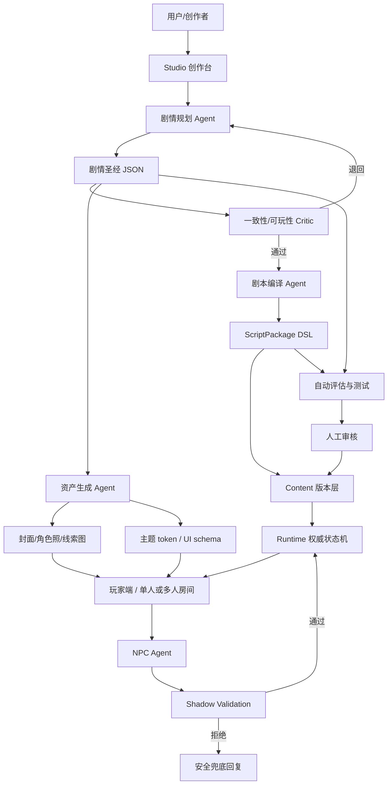

# 剧本杀游戏平台与 LLM 融合的可行性研究与开发方案报告

## 执行摘要

基于对 `yantianqi1/jubensha-ai-platform` 仓库代码、规划文档、提交记录与模型调用链路的审阅，我的结论是：**你的项目方向是可行的，而且技术路线已经选对了“最关键的前半段”**。仓库当前最大的价值，不在于“已经能完整做出 AI 剧本杀产品”，而在于它已经搭起了一个**正确的底座**：用 DSL/状态机做真值与规则裁决，用内容版本化做剧本发布与冻结，用 Shadow Validation 做 LLM 提案的后验审计，用单人 demo 验证 NPC 对话与规则层的边界。这套思路与仓库《最终技术决策书》中“**LLM 管演，状态机管判**”的核心原则一致，也与行业里更可靠的 agent 工程实践高度一致。fileciteturn103file0L1-L1

从开发进度判断，仓库已完成的部分主要集中在 **规则内核、内容发布、运行时、单 NPC 生成边界、单人浏览器 demo、OpenAI-compatible 网关接入**；尚未完成或仅停留在规划层的部分，则是 **创作者工作台、自动剧本生成流水线、多人实时协作、资产生成流水线、治理后台、CI/CD 与生产级观测**。最近几次提交也清晰显示了迭代轨迹：先做 foundation runtime 与 NPC generation，再补 shadow validation，再补 investigation UI 与 playable single-player demo，最后把模型提供方接到 OpenAI-compatible 接口上。fileciteturn79file0L1-L1 fileciteturn102file0L1-L1 fileciteturn98file0L1-L1

如果你的目标是“让用户直接用 LLM agent 简单生成高可玩性、逻辑严密的剧本，并自动适配 UI 与图片生成”，那么**下一阶段不应该直接让模型一把梭生成最终剧本**，而应该采用分层流水线：先生成“剧情圣经/剧情骨架”，再生成“角色、线索、场景、分支与解锁图”，再编译为平台 DSL，最后用验证器、模拟器与人工审核做质量控制。这种“先规划、再写作、再编译、再验证”的路线，与 `Plan-and-Write` 和 DeepMind 的 `Dramatron` 所强调的分层叙事生成是同方向的；而在工程落地上，则应使用结构化输出、严格 JSON Schema、状态图编排和可回放评估，而不是只靠长提示词祈祷模型稳定。citeturn14search2turn15search2turn11search0turn10search1

简言之，这个项目**不是“能不能做”的问题，而是“要不要继续坚持当前底座、并把创作层补上”的问题**。我的建议是：继续坚持当前底层方向，不要推倒重来；把下一个阶段定义为“**剧本生成 Studio + 剧情骨架编译器 + 自动评估/人工审核闭环**”，优先做单人深融合，再做多人协作和图像资产平台化。

## 仓库审阅与当前进度评估

### 当前仓库的实际架构

仓库是一个 `pnpm workspace + Turborepo` 结构，根脚本已经定义了 `dev`、`build`、`lint`、`test`、`typecheck`、`db:up`、`db:down` 等基础工程入口；workspace 包含至少 `apps/api`、`apps/web`、`packages/dsl` 三个核心工作区。TypeScript 采用统一基础配置，说明工程已经不是纯试验脚本，而是按可长期维护的 monorepo 组织。fileciteturn22file0L1-L1 fileciteturn23file0L1-L1 fileciteturn24file0L1-L1

后端是 NestJS。`AppModule` 当前显式装配了 `ContentModule`、`RuntimeModule`、`GenerationModule`，并挂了 `HealthController`、`HomeController`、`DemoController`；这意味着当前产品主线已经是“内容管理 + 运行时 + NPC 生成 + demo 演示”，而不是创作者平台、治理后台或多人系统。`main.ts` 中已接入环境变量加载与 Nest 启动；`.env.example` 里则同时出现了 PostgreSQL、Redis、OpenAI-compatible 模型配置、CORS 与 Web API base 配置，说明部署形态已考虑前后端联调与外部模型网关。fileciteturn38file0L1-L1 fileciteturn39file0L1-L1 fileciteturn86file0L1-L1

前端目前不是《最终技术决策书》中规划的 Next.js 四产品面，而是一个更轻量的 `apps/web` 静态浏览器工作区：通过 `build-static.mjs` 将页面模板与浏览器逻辑打包到 `apps/web/dist`，页面模板展示“线索板、时间线、嫌疑矩阵、NPC 回应”，并通过浏览器脚本调用 API 启动 demo、盘问 NPC、刷新房间状态。这意味着**当前 Web 是“可玩 demo 界面”而不是“完整业务前端”**。这也是代码实现与长期产品架构之间最明显的落差之一。fileciteturn34file0L1-L1 fileciteturn32file0L1-L1 fileciteturn35file0L1-L1 fileciteturn103file0L1-L1

### 已完成模块与完成度判断

从代码和计划文档来看，当前仓库已经完成了几个非常关键的基建模块。`ContentService` 与相关 controller/repository 已能创建草稿包、更新草稿、发布为不可变版本并读取 released version；`RuntimeService` 已能创建房间、执行动作、记录事件并回放；`@jubensha/dsl` 已能表达条件、效果、动作可用性与作用域访问；`GenerationService` 则已经走通“构造 prompt → 调模型 → 解析 JSON → Shadow Validation”的主链路。相关 HTTP 测试也分别覆盖了 content/runtime/generation 三类入口。fileciteturn42file0L1-L1 fileciteturn49file0L1-L1 fileciteturn70file0L1-L1 fileciteturn56file0L1-L1 fileciteturn89file0L1-L1 fileciteturn88file0L1-L1 fileciteturn78file0L1-L1

从最近的规划文档看，开发顺序也比较健康：`foundation-mvp` 先规定内容发布、运行时与 demo 验收；`single-agent-npc-mvp` 再增加 NPC prompt、生成接口与解析；`visibility-shadow-log-mvp` 保证 LLM 提案不直接污染 runtime 真值；`playable-single-player-mvp` 再打通浏览器可玩链路；最后通过最新提交把 `MODEL_PROVIDER=openai-compatible` 与 `/chat/completions` 接口正式接上。这条顺序很像“先定规则引擎边界，再让模型进入”的做法，方向是对的。fileciteturn25file0L1-L1 fileciteturn26file0L1-L1 fileciteturn79file0L1-L1 fileciteturn102file0L1-L1 fileciteturn98file0L1-L1

下面给出一个**基于代码现状的主观工程完成度评估**。这是“按产品可上线程度”而不是“按代码存在与否”估算的，因此更偏 conservative。

| 当前仓库模块 | 代码/文档证据 | 当前状态 | 主观完成度 | 主要技术债 |
|---|---|---|---:|---|
| 规则 DSL 与运行时内核 | `packages/dsl/src/runtime.ts`、`visibility.ts`、`RuntimeService` 已实现条件判断、效果应用、scope 可见性与动作执行。fileciteturn70file0L1-L1 fileciteturn71file0L1-L1 fileciteturn49file0L1-L1 | 可运行 | 75% | 缺少复杂分支图、结局图、冲突矩阵、并发/幂等版本控制的产品级封装 |
| 内容层与版本冻结 | 草稿创建、发布为 released version、版本读取均已具备。fileciteturn42file0L1-L1 fileciteturn89file0L1-L1 | 可运行 | 70% | 缺少创作者 UI、差异比较、版本审阅、审核流 |
| 单 NPC 生成边界 | `GenerationModule`、prompt builder、response schema、shadow validation 已接通。fileciteturn85file0L1-L1 fileciteturn57file0L1-L1 fileciteturn60file0L1-L1 fileciteturn61file0L1-L1 | 可运行 | 55% | 仍偏“问答式”；缺少多 agent 协同、长期记忆、自动重试、审查前置 |
| OpenAI-compatible 模型调用 | 支持从环境变量读取 base URL、API key、model，经 `/chat/completions` 获取 JSON 内容。fileciteturn83file0L1-L1 fileciteturn87file0L1-L1 | 已接入 | 50% | 仅是 provider 适配层；缺少缓存、限流、fallback、成本治理 |
| 单人可玩 Web demo | `apps/web` 可启动 demo、盘问 NPC、显示 shadow 校验与房间状态。fileciteturn102file0L1-L1 fileciteturn35file0L1-L1 fileciteturn36file0L1-L1 | 可演示 | 60% | 仍是 demo，不是完整产品前端；缺登录、剧本入口、创作侧、多人房间、运营后台 |
| 创作者 Studio | 仅存在长期规划，在当前代码中未形成独立实现。fileciteturn103file0L1-L1 | 未实现 | 10% | 是下一阶段核心缺口 |
| 多人实时协作 | 决策文档规划使用 Socket.IO/Colyseus 演进，但当前代码主线仍是单人 demo。fileciteturn103file0L1-L1 fileciteturn102file0L1-L1 | 未实现 | 10% | 需要房间状态机、重连、广播作用域、事件幂等 |
| 资产/图片生成 | 决策文档明确有资产层与图像生成规划，但当前 `AppModule` 未见相应 module。fileciteturn103file0L1-L1 fileciteturn38file0L1-L1 | 未实现 | 5% | 需要异步任务、审查、对象存储、角色一致性方案 |
| CI/CD 与自动上线 | 当前仓库已具备本地 `lint/test/typecheck/build` 和 smoke path，但未体现自动化流水线。fileciteturn22file0L1-L1 fileciteturn79file0L1-L1 fileciteturn102file0L1-L1 | 偏手工 | 20% | 是工程风险，不是玩法风险 |

### 我认为最值得保留的设计

仓库里最值得保留、也是最不应该推翻重做的，是这三点。

第一，**内容与运行时分层**。剧本包发布后冻结为版本，运行房间只消费版本，不直接绑定草稿内容，这个做法是线上剧本杀最重要的“可回滚/可追查/可复盘”前提。fileciteturn42file0L1-L1 fileciteturn49file0L1-L1

第二，**LLM 输出与真值状态隔离**。`GenerationService` 返回 `speech`、`proposals` 以及 `shadowValidation`，Shadow 层审查 proposal 是否越权、是否引用未知 clue/flag/role，且当前计划明确“generation returns proposals but leaves runtime state unchanged”。这是把 LLM 当“提案者”而不是“裁判者”的正确姿势。fileciteturn79file0L1-L1 fileciteturn61file0L1-L1 fileciteturn78file0L1-L1

第三，**作用域意识**。`canAccessScope` / `canAccessAnyScope` 已经把 public 与 requester-scope 分开，这为未来的“公共信息、角色私密、阵营私密、主持视角、系统审计视角”五级可见性打了底。剧本杀一旦进入多人模式，这比“模型多聪明”更重要。fileciteturn71file0L1-L1 fileciteturn79file0L1-L1

### 当前最明显的技术债

当前最大的技术债不是“LLM 不够强”，而是**创作层为空、评估层偏薄、产品面不完整**。

代码里虽然已经有 demo package、scene/action/effect、NPC 问答链路，但还没有面向创作者的“剧情骨架编辑器、角色关系图、线索依赖图、结局与分支图、自动审校面板”；因此**你现在更像是在做“玩法内核原型”，而不是“让用户自助生产内容的平台”**。同时，当前 web 是 playable demo，不是《最终技术决策书》里定义的 `/studio/*`、`/play/*`、`/scripts/[slug]`、`/admin/*` 四产品面；这会导致后续一旦直接加功能，前端形态可能迅速打结。fileciteturn103file0L1-L1 fileciteturn34file0L1-L1 fileciteturn32file0L1-L1

另一个技术债是**模型调用仍偏“单次 completion”**。OpenAI-compatible provider 当前只是简单构造 `system` / `user` 两条消息，POST 到 `/chat/completions`，然后读取首条 `message.content`；这对于 demo 足够，但对于“剧情骨架 → 剧本编译 → 多轮修正 → 失败重试 → 结构化审计”的生产链路还不够，需要上升为 agent runtime、任务队列、批处理与成本治理层。fileciteturn83file0L1-L1 fileciteturn98file0L1-L1

## 行业实践与可行性判断

### 这个方向为什么可行

从研究和产品工程的角度看，你要做的事并不违背 LLM 的能力边界，前提是你**不要让 LLM 直接输出最终真值**，而要让它负责“叙事创造、人物表达、结构提案”，再由规则系统做约束与裁决。`Plan-and-Write` 证明了“先规划 storyline、再生成 story”的层次化生成，相比无计划写作更容易得到连贯、相关、主题一致的故事；DeepMind 的 `Dramatron` 则把这一思路进一步用于长剧本/对白生成，采用从 storyline 到 title、character、scene beats、location、dialog 的层次生成，且强调它是 co-writing system 而非完全自治写作机。你的“先用 LLM 生成剧情，再由 agent 生成剧本”路线，本质上就是这条范式的工程化版本。citeturn14search2turn15search2

与此同时，现代 agent 编排框架已经非常适合处理这种“既有确定性节点，又有模型节点”的流程。LangGraph 明确把自己的定位定义为**长生命周期、状态化、可流式、可人工介入**的 agent orchestration runtime，适合把“剧情规划、角色展开、冲突检查、DSL 编译、重试与人工审核”串成状态图，而不是写成一堆不可追踪的 prompt 链。citeturn10search1

从结构化输出角度，OpenAI 官方已经把 Structured Outputs 作为比 JSON mode 更可靠的方案，支持开发者提供 JSON Schema，让模型输出严格匹配结构；这对于剧本骨架、场景图、角色表、线索表、UI schema、图片任务单等中间件对象都非常关键。也就是说，现在最稳的工程路线，不是“写更狠的提示词”，而是“**先定义 schema，再让模型填 schema**”。citeturn11search0turn11search2

### 这个方向为什么不能只靠大模型裸跑

LLM 在长叙事里最常见的问题，不是格式错，而是**逻辑错、前后矛盾、越权泄露、因果链断裂**。OpenAI 的 Structured Outputs 只能保证“格式正确”，不能保证字段值的故事逻辑一定正确；Anthropic 的 prompt engineering 文档也强调，在提示词优化之前先定义成功标准与经验评估，否则很多问题并不该靠 prompt 强拧出来。换句话说：**结构化输出解决“像不像 JSON”，不能解决“像不像一个能玩的剧本”**。citeturn11search0turn9search1

这也正是你当前仓库架构正确的原因：仓库《最终技术决策书》明确提出“LLM 管演，状态机管判”，并把 Shadow log、visibility、unlock 规则、authoritative state 作为强边界。这个设计与外部最佳实践是相容的。真正不可行的做法反而是把剧本杀当聊天机器人，直接让 NPC 与玩家自由发挥、不设真值边界。fileciteturn103file0L1-L1

### 与现有仓库相比，行业实践领先在哪里

外部最佳实践领先的地方，主要不在底层 API，而在三件事。

其一是**层次化写作**。Dramatron 不是直接写整本剧本，而是先写结构，再写场景，再写对白。你的仓库现在已经有了 scene/action/effect 的规则层，但还没有“剧情圣经/角色弧线/冲突矩阵/结局图/线索依赖图”这层中间语义结构。也就是说，**你已经有“编译器后半段”，缺“编译器前半段”**。citeturn15search2turn14search2

其二是**显式评估**。Anthropic 文档强调要先定义 success criteria；LangGraph 生态强调 trace、evaluation、human-in-the-loop；OpenAI structured outputs 文档也强调 schema 只是一部分。你当前仓库有 HTTP 测试和 rule-level 测试，但还没有“剧本质量评估器”。后者应该至少包括：时间线一致性、角色知识隔离、关键谜题可解性、胜利路径可达性、假线索不致崩盘、局内情绪张力、单轮 NPC 响应的风格一致性。citeturn9search1turn10search1turn11search0

其三是**多模态资产与界面生成的工程化**。OpenAI 官方支持图像生成/编辑，SDXL 论文强调更强的高分辨率与多长宽比训练，IP-Adapter 则提供了轻量 image prompt 能力，使角色照、封面、房间背景图更容易做角色一致性控制。这意味着“让用户简单生成剧本并自动配图”，在技术上并不难；难的是你要把它做成**资产流水线**而不是“在一个页面上顺手调图”。citeturn8search3turn13search0turn16search0

## 建议目标架构与关键维度

### 建议的目标架构

下面这张图，是在尊重你现有底座的前提下，我建议的下一阶段目标架构。它不是推倒重来，而是把你已经有的 `content/runtime/generation/dsl` 向“Studio + Agent Pipeline + Asset Pipeline + Evaluation”扩展。



这个架构的关键是：**剧情规划、剧本编译、NPC 演绎、UI/资产生成、自动评估**是五条不同责任线，不能混成一个 agent。剧情骨架要允许人工介入；最终运行时仍然只接受 DSL 和经验证的提案。

### 关键维度对照表

下面这张表，按照你指定的关键属性来对照“当前仓库现状”和“建议方案”。

| 维度 | 当前仓库现状 | 建议目标 | 实现要点 |
|---|---|---|---|
| 输入输出格式 | 当前已有脚本包、房间状态、NPC response、shadow validation 等结构化对象。fileciteturn74file0L1-L1 fileciteturn70file0L1-L1 fileciteturn60file0L1-L1 | 增加“剧情圣经 JSON”“角色弧线 JSON”“线索依赖图 JSON”“UI schema JSON”“图片任务单 JSON” | 全部使用 JSON Schema + Zod；生成链条禁止自由文本直传下游，统一通过 schema 过闸。citeturn11search0 |
| 提示词模板规范 | 当前有 NPC prompt builder，但尚未形成完整创作模板规范。fileciteturn57file0L1-L1 | 建立 system prompt + schema + few-shot + self-check 四段式模板 | Prompt 元信息要版本化；不要把业务约束写死在长自然语言里，应转为枚举、布尔、图结构 |
| 剧情一致性与可玩性评估 | 当前偏 rule-level 校验和 HTTP 测试。fileciteturn77file0L1-L1 fileciteturn78file0L1-L1 | 增加自动评估器 + 人工审核面板 | 评估项包括 timeline consistency、knowledge isolation、谜题可解性、分支可达性、关键 clue 覆盖率、GM 可控性 |
| 角色设定与分支逻辑 | 当前 demo 已有角色、线索、场景、动作、effects。fileciteturn74file0L1-L1 fileciteturn70file0L1-L1 | 提升到“角色目标/秘密/关系/情绪状态/背叛触发器/结局条件”层 | 角色与剧情骨架分离存储，允许多版本重编译 |
| 多人协作与实时交互 | 规划中有多人房间与 Socket.IO，但当前代码主线仍是单人可玩 demo。fileciteturn103file0L1-L1 fileciteturn102file0L1-L1 | 第二阶段加入 room state machine、重连、广播作用域、观战与回放 | 作用域消息必须服务端裁切；客户端永不拿到不属于自己的数据 |
| 界面/美术与图片生成 | 当前有 investigation UI demo，但无图像资产流水线。fileciteturn32file0L1-L1 fileciteturn35file0L1-L1 | 生成主题 token、封面、角色照、线索插图 | 可用 GPT Image / DALL·E 或 SDXL；若要角色一致性，建议引入 IP-Adapter 或参考图方案。citeturn8search3turn13search0turn16search0 |
| 性能与成本估算 | 当前仓库已考虑 OpenAI-compatible provider 与 Redis/Postgres 环境。fileciteturn86file0L1-L1 | 按创作链路与运行链路分开记账 | 创作链路可 batch；运行链路要求低时延、短上下文、缓存前缀 prompt。OpenAI/Anthropic 均提供 prompt caching / batch 省成本能力。citeturn8search1turn9search0 |
| 隐私与安全 | 当前已开始做 shadow validation；长期决策文档强调 provider adapter 与服务端权威。fileciteturn79file0L1-L1 fileciteturn103file0L1-L1 | 增加内容审核、日志分级、审计流 | 文本与图像都应做 moderation；官方 moderation 支持 text+image，且可免费使用。citeturn12search0turn12search6 |
| 可扩展性与部署 | 当前可本地 `db:up`、`db:schema`、API + static web smoke。fileciteturn102file0L1-L1 | 分为 Web/API/Worker/Asset Worker 四类服务 | 先单机服务化，后按生成任务拆 Worker；事件与缓存分离 |
| 测试与上线流程 | 当前有 unit/http tests 与 smoke path。fileciteturn77file0L1-L1 fileciteturn78file0L1-L1 fileciteturn88file0L1-L1 fileciteturn89file0L1-L1 | 增加 contract tests、golden dataset、simulated playtests、A/B eval | 上线前必须跑自动化评估 + 小规模人工试玩，不建议“只有单元测试就上线内容” |

### 性能与成本估算

在文本模型上，如果你把“NPC 单轮盘问”控制在**约 6k 输入 token + 500 输出 token**的量级，按照 OpenAI 官方当前 GPT-5.4 mini 价格，单轮成本大约在 **$0.00675** 左右；如果换到 Anthropic Sonnet 级别，单轮会更高，约是 OpenAI mini 的数倍。因此运行期更适合用 mini/Haiku 级模型，复杂的一致性审校再异步调用更强模型。OpenAI 官方还提供 Batch 与 cached input 降本路径；Anthropic 也提供 batch 与 prompt caching。citeturn8search1turn9search0

如果按“单房间 20 次 NPC 盘问”来估算，运行期文本成本用 mini 模型大致可以压在 **$0.1–0.2/房间** 量级；而图像生成成本通常会比文本显著更高，因此建议把图像生成放在**创作期与上架期**，不要放在每局运行期。对于图像方案，若使用 OpenAI 图像 API，计费来自文本/图像 token；若走 SDXL，自托管成本转为 GPU 与队列。仓库内部决策文档对“MVP、百房间/日规模”的月成本预估是 **$400–1100**，这个量级是合理的早期参考，但你最好把它当作“上限范围”而不是固定预算。citeturn8search1turn8search3 fileciteturn103file0L1-L1

## 剧情先生成再由 agent 生成剧本的实施流程

### 推荐的生成流水线

我建议把“用户一键生成剧本”的内部实现拆成六步，而不是一条 prompt。


这六步分别做不同的事。

**第一步，用户输入题材约束。** 输入不要是“给我写一个剧本杀”这种自然语言，而应是带字段的表单对象，例如：题材、人数、时长、难度、世界观、是否允许超自然、主要情绪张力、核心机制倾向、是否偏新手、是否需要多人模式。这样可以保证后续 agent 接受的是明确约束，而不是模糊要求。

**第二步，剧情规划 Agent 生成剧情圣经。** 这一层只产出“圣经”，不能产出最终剧本。圣经至少应包含：世界设定、主题命题、核心案件真相、凶手/真相链、角色表、角色秘密、角色关系、时间线、关键冲突点、关键线索表、伪线索表、章节/幕结构、结局条件。这里建议采用 static planning 优先，因为对于推理/还原型剧本，先整体规划比边写边编更稳。`Plan-and-Write` 也表明显式 storyline planning 在 coherence、diversity、topic relevance 上优于无计划写作。citeturn14search2

**第三步，一致性检查 Agent。** 这一步不写新内容，只做批判式检查。输出至少包括：时间线是否闭合、每个关键结论是否至少由两个独立证据链支撑、每个红鲱鱼是否不会破坏唯一解、角色私密知识是否泄露、每个场景是否推进主线、玩家是否存在卡死点。这里建议既做 rule-based graph checks，也做 LLM Critic。LangGraph 适合把“写作节点”和“批判节点”放进同一状态图，并支持人工在关键节点介入。citeturn10search1

**第四步，剧本编译 Agent。** 通过的剧情圣经，才允许编译为平台 `ScriptPackage DSL`。这里不是“重写故事”，而是把圣经转成平台可执行对象：角色、线索、场景、动作、条件、效果、可见性、胜利/结局钩子，并额外生成玩家手册、角色私稿、主持说明、线索卡、展示页摘要等不同产物。由于当前仓库已经有 content/runtime/dsl，你实际上只需要补“圣经 → DSL”的编译器前半段。fileciteturn70file0L1-L1 fileciteturn42file0L1-L1

**第五步，自动化评估器。** 对编译出的 DSL 跑模拟。用 rule engine 自动遍历主分支、伪分支、关键 clue 解锁路径，检测是否存在无法进入的 scene、无法触发的 action、未引用 clue、无来源真相、过早泄密、玩家必卡死等。然后再让 LLM judge 从“可玩性、推理满足感、角色区分度、情绪节奏”四个维度给出分数和问题清单。注意，这一步的 LLM judge 只能做辅助评分，不能替代图搜索与规则检查。

**第六步，人工审核。** 这是最容易被忽略、但对 UGC 平台最重要的一步。Dramatron 也强调 co-writing 而不是 fully autonomous generation。平台若要允许用户“简单生成并直接发布”，必须把审核工作做成可视化差异面板，而不是只在人脑里看长文本。citeturn15search2

### 建议的中间对象格式

我建议新增一个“剧情圣经”对象，作为所有生成环节的核心输入输出。下面给一个适合直接做 JSON Schema 的结构骨架。

```json
{
  "meta": {
    "title": "string",
    "genre": "mystery|emotion|campus|historical|horror|comedy",
    "player_count": 6,
    "duration_minutes": 240,
    "difficulty": "easy|medium|hard",
    "supernatural_allowed": false
  },
  "theme": {
    "premise": "一句话设定",
    "theme_statement": "主题命题",
    "tone": ["压抑", "悬疑", "反转"]
  },
  "truth": {
    "core_case": "真相摘要",
    "killer_or_core_secret": "关键真相",
    "timeline": [
      {"t": "D-30", "event": "事件", "actors": ["A"], "public": false}
    ]
  },
  "characters": [
    {
      "id": "char_a",
      "name": "角色名",
      "public_profile": "公开介绍",
      "private_secret": "私密信息",
      "goal": "局内目标",
      "fear": "恐惧点",
      "arc": "人物弧线",
      "relations": [{"target": "char_b", "type": "love|hate|debt|kinship"}]
    }
  ],
  "clues": [
    {
      "id": "C-01",
      "title": "线索名",
      "fact_value": "它证明什么",
      "red_herring": false,
      "unlock_conditions": ["scene_2_done", "ask_butler_about_window"]
    }
  ],
  "acts": [
    {
      "id": "act_1",
      "objective": "这一幕推进什么",
      "scenes": [
        {
          "id": "scene_1",
          "entry_conditions": [],
          "available_actions": [],
          "expected_reveals": ["C-01"]
        }
      ]
    }
  ],
  "endings": [
    {
      "id": "ending_true",
      "conditions": ["killer_identified", "motive_explained"],
      "emotion_payoff": "真结局情绪落点"
    }
  ]
}
```

### 示例提示词模板

下面给出一个适合“先生成剧情圣经”的系统提示词模板。核心原则不是“越长越好”，而是**边界、字段、禁止项、评估标准都清楚**。若使用 OpenAI，建议直接给 JSON Schema；若使用 Anthropic，也建议把 schema、few-shot、硬边界与 self-check 分段写明。citeturn11search0turn9search1

```text
你是“剧本杀剧情规划师”，不是最终写作者。
你的任务是：根据用户输入，生成一个“剧情圣经 JSON”，供后续编译器转换为剧本 DSL。
你必须遵循以下要求：

[目标]
- 生成逻辑严密、可玩、可推理、适合剧本杀的剧情骨架
- 只输出 JSON，不输出解释
- 必须保证关键真相可被证据链支持
- 必须保证不存在“只有作者知道、玩家不可达”的关键真相

[硬约束]
- 玩家人数：{{player_count}}
- 时长：{{duration_minutes}}
- 风格：{{genre}}
- 是否允许超自然：{{supernatural_allowed}}
- 目标受众：{{audience}}
- 核心体验：{{core_experience}}

[禁止项]
- 不要生成无法落地到场景/行动/线索的空泛设定
- 不要让关键结论只由单一台词支撑
- 不要让角色动机完全重复
- 不要生成无法在局内被解释的巧合式反转

[输出标准]
- 输出必须匹配给定 JSON Schema
- timeline 必须按时间排序
- 每个关键场景都要标明 expected_reveals
- 每个角色都必须有 public_profile / private_secret / goal / arc

[自检]
在 internal_check 中回答：
1. 真相是否唯一可解释？
2. 是否存在无法被玩家触达的必要信息？
3. 是否存在角色动机薄弱或重复？
4. 哪三个线索最关键？
```

然后，第二阶段“剧情圣经 → DSL 编译 Agent”模板则要更工程化，像这样：

```text
你是“剧本编译器”，负责把剧情圣经转换为 ScriptPackage DSL。
你不是创意写作者；你只能做结构映射、补齐编码与约束检查。

[输入]
- bible_json
- target_dsl_schema
- style_prefs
- package_code

[输出]
- package_code
- title
- roles[]
- clues[]
- scenes[]
- diagnostics[]

[转换规则]
- 每个 scene 必须含 scene_code, phase, visible_to, actions, end_if, entry_if
- 每个 clue 必须绑定 unlock_if 或说明初始可见性
- 关键推进节点必须至少对应一个 action.effect
- 不允许引用不存在的 clue / flag / role / scene
- 所有 diagnostics 必须结构化输出

[失败策略]
- 若无法编译，返回 diagnostics，不要输出部分合法部分非法的 DSL
```

### 验证、自动化测试与质量控制

我建议把质量控制拆为三层。

**第一层，结构化校验。** 这是 schema 级，主要检查 JSON 格式、枚举合法性、字段完整性、编码唯一性。OpenAI Structured Outputs 非常适合做这一层；你甚至可以直接把剧情圣经与 DSL 两套 schema 做成 API 级约束。citeturn11search0turn11search2

**第二层，规则模拟。** 这是你当前仓库最容易扩展的地方。既然 `RuntimeState`、conditions、effects、room replay 都已有实现，就应该新增 `simulation test harness`：自动构造若干玩家行动序列，检测局是否可通、关键线索是否会死锁、是否存在太早暴露真相的路径、结局条件是否可以达到。当前仓库已经能 replay room，这为“自动跑局”打了基础。fileciteturn49file0L1-L1 fileciteturn88file0L1-L1

**第三层，LLM 评审 + 人工审核。** 让一个 Critic agent 从以下维度打分：剧情逻辑、角色差异、线索冗余度、误导质量、演绎张力、复盘满足感；再让人工只看“低分项 + red flags”而不是从头读全文。这样人工审核才能有规模化可能。Anthropic 文档特别强调要先定义 success criteria 与 empirical evaluations，这与这里完全一致。citeturn9search1

一个可执行的评分框架可以是：

| 评估项 | 自动化方法 | 阈值建议 |
|---|---|---|
| 时间线一致性 | 图排序 + 事件依赖检查 | 必须通过 |
| 引用完整性 | DSL 引用校验 | 必须通过 |
| 关键真相可达性 | 模拟跑局 + 最短路径 | 必须存在至少一条主解路径 |
| 角色知识隔离 | scope 检查 + shadow validation | 必须通过 |
| 可玩性基础分 | LLM Critic 多次打分取中位数 | < 7/10 自动退回 |
| 角色区分度 | embedding 相似度 + LLM judge | 任意两角色高度同质则退回 |
| 线索冗余度 | 线索-结论覆盖度矩阵 | 关键结论至少 2 条独立证据支撑 |
| 风险内容 | moderation 文本/图像 | 任一高风险则退回或人工复核 |

## 路线图、风险与结论

### 当前仓库模块与建议模块对照

| 当前仓库模块 | 是否建议保留 | 建议新增模块 | 说明 |
|---|---|---|---|
| `packages/dsl` 规则表达与 runtime helpers | 强烈保留 | `packages/story-bible-schema` | 现有 DSL 负责“可执行”，新增 bible schema 负责“可创作” |
| `apps/api/src/content/*` 内容版本层 | 强烈保留 | `studio-content-service` | 加创作草稿、diff、审阅、审核状态 |
| `apps/api/src/runtime/*` 权威运行时 | 强烈保留 | `simulation-service` | 自动跑局、回放分析、死锁检测 |
| `apps/api/src/generation/*` NPC 生成层 | 保留并扩展 | `story-planner-agent`、`script-compiler-agent`、`critic-agent` | 不能只做 NPC 问答，要接入创作者流水线 |
| `shadow-validation.ts` | 强烈保留 | `pre-publish-validator` | 把 shadow 思路扩展到生成内容发布前 |
| `apps/web` 可玩 demo | 局部保留 | `studio-web`、`play-web`、`admin-web` | 当前 demo 可作为 `/play` 的原型，不适合直接长成全产品 |
| OpenAI-compatible provider | 保留 | `model-router`、`budget-controller`、`fallback-policy` | 当前只是 adapter，不是网关治理层 |
| `demo-package.ts` | 保留为 fixture | `golden-packages` | 用作测试集与回归对照集 |

### 开发里程碑与时间估算

由于预算、团队规模、目标上线时间均未指定，我更建议用**人周**来估，而不是写死成日历。如果是 2–3 名有全栈/AI 工程能力的工程师并行推进，可大致按下表折算；若单人开发，则时间近似线性放大。

| 迭代阶段 | 主要目标 | 关键交付 | 估算 |
|---|---|---|---:|
| Sprint A | 把现有底座产品化 | 整理 API contract、前后端路由划分、补 CI、补日志与错误码 | 3–4 人周 |
| Sprint B | 做剧情圣经层 | `story-bible` schema、planner agent、critic agent、基础审校 | 4–6 人周 |
| Sprint C | 做“圣经 → DSL”编译 | script compiler、diagnostics、自动 simulation harness | 4–6 人周 |
| Sprint D | 做 Studio 最小可用版 | 题材表单、剧情骨架编辑、角色关系图、生成/重试/差异面板 | 5–8 人周 |
| Sprint E | 接图片与主题流水线 | 角色照、封面、线索图、主题 token、展示页适配 | 4–6 人周 |
| Sprint F | 做预发布质量闭环 | 自动评估、人工审核工作台、回归测试集 | 3–5 人周 |
| Sprint G | 做多人运行基础 | room state machine、scope broadcast、重连与观战基础 | 6–10 人周 |

如果只追求“用户可一键生成单人可玩的高质量剧本 + 自动适配 UI/配图”的**第一可售版本**，我建议优先做 `A + B + C + D + E`，总量大约 **20–30 人周**，这是一个现实且可控的第一阶段范围。

### 风险与缓解措施

| 风险 | 影响 | 缓解措施 |
|---|---|---|
| 剧情骨架逻辑不闭合 | 生成剧本表面漂亮但不可玩 | 强制引入“剧情圣经 → DSL → 模拟器”三段法，不允许直接生成成品 |
| NPC 泄露私密信息 | 多人玩法公正性被毁 | 保留并扩展 scope + shadow validation，所有输出区分 speech 与 proposal |
| 自动生成剧本质量波动大 | 用户体验不稳定、投诉高 | 先做模板化题材与风格预设；从少量“高成功率模板”起步 |
| 创作者 UI 太晚做 | 技术完成但内容生产不可用 | 下一阶段优先级应把 Studio 提到第一梯队 |
| 图片资源风格不统一 | 页面观感和角色识别崩 | 统一角色卡 prompt + 参考图 + IP-Adapter/参考图约束；不要每张图都从零启动生成。citeturn16search0turn13search0 |
| 成本失控 | 生成链路太多，单次创作开销爆炸 | 把“创作链路”与“运行链路”分开，前者支持 batch、后者走 mini/缓存 |
| 审核不过关 | UGC 平台上线风险 | 文本与图像都做 moderation；必要时设置半自动发布。citeturn12search0turn12search6 |
| 过早投入多人模式 | 系统复杂度飙升 | 先把单人深融合跑通，并沉淀可回归的 golden packages |

### 结论

你的项目当前最有价值的地方，是**已经把“AI 剧本杀”最容易做错的底层边界做对了**。内容版本化、权威运行时、Shadow Validation、作用域访问控制、OpenAI-compatible provider、单人可玩 demo，这些都说明项目不是停留在概念阶段，而是已经完成了一个扎实的“玩法内核 MVP”。fileciteturn42file0L1-L1 fileciteturn49file0L1-L1 fileciteturn79file0L1-L1 fileciteturn102file0L1-L1

真正的下一步，不是继续往现有 NPC 问答链路上补功能，而是把**创作层**补出来：增加剧情圣经 schema、planner/critic/compiler 三类 agent、自动跑局与质量评估、Studio 创作台、图片与 UI 主题流水线。只要走这条路，你的项目就会从“一个能玩的 AI 规则原型”进化为“一个用户可自助创作、平台可审核发布、玩家真正能玩的剧本杀生成平台”。`Plan-and-Write` 和 `Dramatron` 已经证明层次化创作是正确方向，LangGraph 和 Structured Outputs 则提供了足够成熟的工程抓手，而你自己的仓库底座也已经对路。citeturn14search2turn15search2turn10search1turn11search0

我给出的最终优先级建议是：

**最高优先级**：补 `story-bible schema`、`planner/critic/compiler`、自动 simulation、Studio 最小可用版。
**中优先级**：主题/UI schema、封面/角色照/线索图流水线、预发布质检面板。
**低于前两级**：多人实时、公共匹配、治理后台大而全。

如果只允许一句话总结：**继续沿用你当前“LLM 管演、状态机管判”的底座，不要推翻；下一阶段全部火力应集中到“剧情圣经 → 剧本 DSL → 自动评估 → Studio 创作台”这条生产链上。**

## 开放问题与局限

本次审阅主要基于 GitHub 连接器可见的仓库文件、计划文档与提交信息完成。通过 GitHub connector 未检索到该仓库公开的 issue / PR 历史，因此协作流程、review 习惯与实际 CI 运行状态的判断会保守一些。另一个局限是：当前仓库中与创作者工作台、多人模式、图片资产相关的内容多数还停留在规划文档或长期技术决策上，因此这些部分的评估更多是在“现有底座之上如何落地”的工程判断，而不是对既有实现的验收。