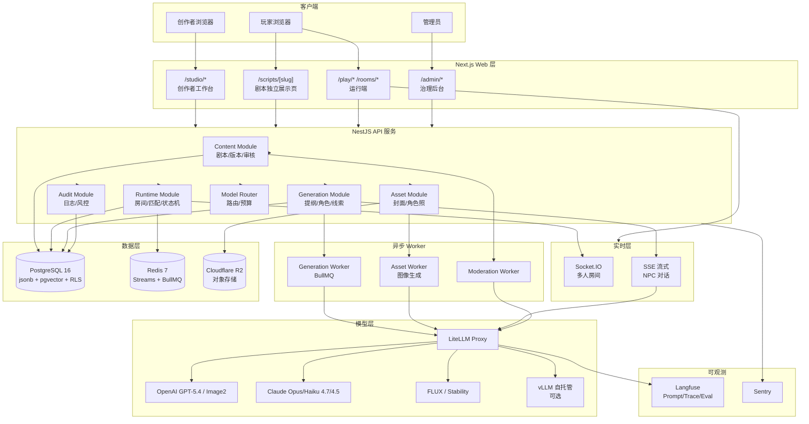
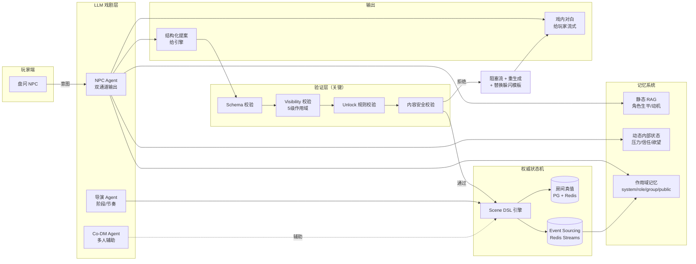
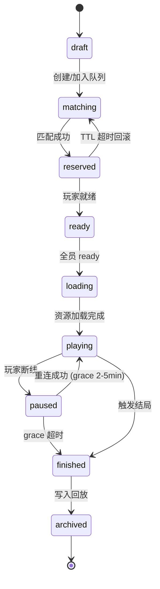

# LLM 驱动剧本杀平台 · 最终技术决策书

> 综合三份研究报告（架构蓝图 / 工程方案 / 玩法融合）的最终落地决策

---

## 0. 核心立场（一句话）

> **LLM 管"演"，状态机管"判"**：把 LLM 当作强表达的"戏剧层"，把可玩性的真值/权限/解锁/结算永远留在可审计的规则系统里。先做"剧本包格式 + 版本发布 + 服务端权威运行 + 模型网关 + 双通道 NPC"五件事，再追求更花哨的 AI 能力。

---

## 1. 顶层架构决策

### 1.1 四层产品面拆分

| 产品面 | 职责 | 路由 |
|---|---|---|
| **创作者工作台 (Studio)** | 剧本 DSL 编辑、AI 辅助创作、素材生成 | `/studio/*` |
| **剧本独立展示页** | SEO 友好的剧本详情、试玩入口 | `/scripts/[slug]` |
| **玩家运行端** | 单人 / 多人 / 观战 / 回放 | `/play/*` `/rooms/*` |
| **治理后台** | 审核、模型路由、配额、风控 | `/admin/*` |

### 1.2 四层数据/服务拆分

```
内容层 (Content)   ← 版本化剧本包，发布即冻结
运行层 (Runtime)   ← 服务端权威状态机
资产层 (Assets)    ← 异步图像/音频流水线
模型层 (Model)     ← 统一网关 + 多供应商
```

---

## 2. 最终技术栈

### 2.1 核心栈

| 层 | 选型 | 关键理由 |
|---|---|---|
| **前端框架** | Next.js 15 App Router + React 19 + TypeScript | 同域承接四种产品面；SSR + RSC；多租户演进路径清晰 |
| **UI 组件** | Tailwind CSS v4 + shadcn/ui | CSS Variables 实现"千本千面"主题隔离 |
| **生成式 UI** | Vercel AI SDK (`ai/rsc`) | LLM 流式渲染 React 组件，不让模型直出 HTML |
| **后端框架** | NestJS + TypeScript | 模块化组织 content/runtime/generation；前后端共享类型 |
| **实时通信** | Socket.IO（首发）→ Colyseus（扩展期） | 嵌业务 API 简单，房间压力大再拆 |
| **主数据库** | PostgreSQL 16 + `jsonb` + pgvector | 关系数据 + DSL 半结构化 + 模板向量检索 + RLS 一把梭 |
| **缓存/队列/事件** | Redis 7 + BullMQ + Redis Streams | BullMQ 跑生成任务；**Streams 做事件溯源**（不要用 Pub/Sub） |
| **对象存储** | Cloudflare R2 | 出口免费，100GB ≈ $1.35/月 |
| **LLM 网关** | LiteLLM Proxy | 统一多供应商，回退/预算/限流 |
| **Agent 编排** | LangGraph (TS) | 状态图天然匹配剧本杀阶段机 |
| **Prompt 治理** | Langfuse | 版本化 + trace + eval 一体 |
| **内容审核** | OpenAI Moderation（免费）+ 人工队列 | 文本/图像双模态 |

### 2.2 模型选型

| 任务 | 主模型 | 备选 | 理由 |
|---|---|---|---|
| **剧本草稿/角色/线索/scene DSL** | GPT-5.4 mini | Claude Haiku 4.5 | 便宜（$0.75/$4.50 per M tokens），Structured Outputs 稳定 |
| **全局一致性审校 / 复杂结局** | Claude Opus 4.7 | GPT-5.4 | 长上下文推理强 |
| **NPC 实时对话** | Claude Haiku 4.5 / GPT-5.4 mini | 微调小模型 | 低延迟优先 |
| **意图识别 / 分类** | Haiku 4.5 / Llama 3 8B（自托管） | — | 极致省钱 |
| **Embedding** | text-embedding-3-small | bge-m3 | RAG 记忆库 |
| **图像生成** | GPT Image 2（主）| FLUX Pro / Stability Core | Provider Adapter 抽象，避免锁定 |
| **审核** | OpenAI Moderation | — | 免费，文图双模态 |

### 2.3 部署栈（首发）

| 组件 | 平台 | 备注 |
|---|---|---|
| Web (Next.js) | Vercel 或 Cloudflare Pages | SSR + 边缘 |
| API + Realtime (NestJS) | Railway / Fly.io | 持久 Socket 连接 |
| Generation Worker | Railway / Modal | 可独立扩缩 |
| PostgreSQL | Supabase / Neon | 含 RLS、pgvector |
| Redis | Upstash / Railway Redis | Streams + BullMQ |
| 对象存储 | Cloudflare R2 | — |
| 监控 | Sentry + Langfuse + OpenTelemetry | LLM 与业务链路分开看 |

---

## 3. 系统架构图

### 3.1 总体架构



### 3.2 运行时融合架构（核心创新）



### 3.3 多人房间状态机



---

## 4. 数据模型核心表

### 4.1 内容版本组

| 表 | 关键字段 | 说明 |
|---|---|---|
| `script_package` | id, org_id, slug, title, current_stable_version_id | 剧本逻辑身份 |
| `script_version` | id, package_id, semver, state, manifest_jsonb, theme_jsonb | **版本快照（不可变）** |
| `script_role` | id, version_id, public_profile_jsonb, private_secret_jsonb, **internal_state_schema_jsonb** | 角色定义（含动态状态模板） |
| `script_clue` | id, version_id, visibility_rule_jsonb, unlock_rule_jsonb | 线索（含 5 级作用域） |
| `script_scene` | id, version_id, scene_jsonb | scene DSL |

### 4.2 运行回放组（融合层关键）

| 表 | 关键字段 | 说明 |
|---|---|---|
| `room` | id, script_version_id, mode, status, snapshot_version | 房间主体 |
| `room_seat` | id, room_id, user_id, role_id, reconnect_token | 座位/重连票据 |
| `room_event` | id, room_id, seq_no, event_type, **visibility_scope**, payload_jsonb | **5级作用域事件流** |
| `room_snapshot` | id, room_id, seq_no, state_jsonb | 房间快照 |
| `npc_state` | room_id, role_code, **dynamic_state_jsonb** (压力/信任/欲望) | NPC 动态内部状态 |
| `llm_proposal_log` | id, room_id, agent_type, raw_proposal_jsonb, validation_result, accepted | **Shadow log：所有 LLM 提案先入此表** |

### 4.3 NPC 双通道输出 Schema

```typescript
interface NPCResponse {
  // 通道 A：戏内回答（流式给玩家）
  speech: string;
  speech_act: 'denial' | 'partial_admission' | 'deflection' | 'admission' | 'question_back';

  // 通道 B：结构化提案（给引擎裁决）
  claims: string[];                    // 声称的事实 ID
  proposed_events: Array<{
    type: 'mark_contradiction' | 'candidate_unlock' | 'reveal_emotion' | ...;
    target?: string;
    clue_id?: string;
  }>;
  memory_writes: Array<{
    scope: 'system' | 'role_private' | 'group_private' | 'public_confirmed' | 'public_rumor';
    truth_status: 'fact' | 'claim' | 'lie';
    content: string;
  }>;
  internal_state_delta: {              // 动态状态变化
    pressure?: number;
    trust_to_player?: Record<string, number>;
    decided_to_shift_blame?: boolean;
  };
  confidence: number;
}
```

### 4.4 Scene DSL 示例

```json
{
  "scene_code": "act2_interrogation",
  "phase": "investigation",
  "entry_if": ["flags.intro_finished == true"],
  "visible_to": ["seat:1", "seat:2", "moderator"],
  "timer_sec": 900,
  "actions": [
    {
      "code": "inspect_window",
      "allow_if": ["inventory.has('gloves')"],
      "effect": [{"type": "reveal_clue", "clue_code": "C-12"}]
    }
  ],
  "end_if": ["all_required_clues_revealed", "timer.expired"],
  "win_rule_hooks": ["team.truth_progress += 20"]
}
```

---

## 5. LLM 介入策略（按本型差异化）

| 本型 | LLM 介入度 | 主要角色 |
|---|---|---|
| **推理本 / 还原本** | 🟢 高 | NPC 自由审问、线索归类、矛盾提示、时间线整理 |
| **情感本** | 🟢 高 | 信件/梦境/独白/后日谈生成、关系修复 |
| **演绎本** | 🟢 高 | 角色台词建议、戏剧节奏 |
| **欢乐本** | 🟡 中 | 抖包袱、接梗、氛围 |
| **恐怖本** | 🟡 中 | 多模态氛围（需强化适龄/红线） |
| **机制本 / 阵营本** | 🔴 低 | **只做 flavor text + 新手引导**，胜负归规则机 |

### 5.1 单人模式 LLM 分工

| Agent | 职责 |
|---|---|
| **导演 Agent** | 阶段切换、节奏控制、催促 |
| **演员 Agent (NPC×N)** | 独立 RAG + 动态状态，扮演 NPC |
| **编剧/场景 Agent** | 环境反馈、叙事缝合 |
| **规则机** | 真值/解锁/结算（**非 LLM**） |

### 5.2 多人模式 LLM 定位（Co-DM, 非 Judge）

| 角色 | 介入时机 | 风险等级 |
|---|---|---|
| 气氛主持 | 开场/转场/沉默催促/赛后收口 | 🟢 低 |
| 新手私教 | 私聊解释规则、整理可说观点 | 🟢 低 |
| 缺人替补 | 仅接边缘 NPC，不接核心裁决 | 🟡 中 |
| 内容风控助手 | 标注违规，人工或规则机决定处罚 | 🟡 中 |
| 复盘师 | 赛后多视角总结 | 🟢 低 |

---

## 6. 延迟预算（按交互分级）

| 交互类型 | 目标预算 | 实现策略 |
|---|---|---|
| 按钮确认 / 搜证回显 | < 300ms | 服务端预计算，纯 DB 操作 |
| NPC 首句流式开始 | 1–1.5s | SSE + 预热 + 短上下文 |
| NPC 普通短答完结 | 3–5s | Haiku 4.5 / mini 模型 |
| 复杂推理 / 阶段切换 | 8–15s + 进度反馈 | "思考中/检索证据中"占位 |
| 一致性审校 / 复盘 | 异步 + 通知 | BullMQ + Webhook |

---

## 7. 失败兜底机制

```
所有 LLM 提案 → Shadow Event Log → 验证器
                                    ↓
                                Phase 检查
                                Visibility 5级作用域
                                Unlock 规则
                                内容安全
                                    ↓
                          通过 ──→ 提交 Authoritative State
                                    ↓
                          拒绝 ──→ 阻塞流式输出
                                    ↓
                                   重生成 (最多 2 次)
                                    ↓
                                  仍失败 → 替换躲闪模板
                                    ↓
                          已泄露 → 撤销事件 + 补丁广播 + 审计告警
```

---

## 8. 开发路线图（4 阶段 × 12 个月）

### 阶段 1：单人深融合 MVP（M1–M3）

**目标**：跑通"自由审问 + 结构化线索板 + 可验证解锁"完整闭环

| 周次 | 交付物 |
|---|---|
| W1–W2 | 项目脚手架（Next.js + NestJS + PG + Redis + R2） |
| W3–W4 | Scene DSL 设计 + 解析器 + 验证器 |
| W5–W6 | 剧本包 CRUD + 版本冻结发布 |
| W7–W8 | 单 Agent NPC（RAG 记忆 + 双通道输出） |
| W9–W10 | 5 级 visibility 作用域 + Shadow log 验证器 |
| W11 | 生成式 UI（线索板/时间线/嫌疑矩阵） |
| W12 | 第一个完整单人推理本可玩 |

**关键风险**：DSL 设计返工 → 第一周必须出 v0.1 草案并预先写 5 个不同本型试

### 阶段 2：多人 Copilot DM（M4–M6）

| 模块 | 交付 |
|---|---|
| 房间状态机 | Socket.IO + 状态转移 + 重连 grace |
| 邀请码房 | 完整流程 |
| 服务端权威 | 所有行动验证 + 幂等 |
| Event Sourcing | Redis Streams + room_event 持久化 |
| Co-DM Agent | 气氛主持 + 私聊新手私教 + 复盘师 |
| 观战 | 30s 延迟，仅公共信息 |

### 阶段 3：创作者生态 + UGC（M7–M9）

| 模块 | 交付 |
|---|---|
| 创作者工作台 | 多 Agent 创作管线（Outline/Character/Clue/Critic） |
| 图像资产流水线 | GPT Image 2 + FLUX fallback + 角色一致性（IPAdapter） |
| 主题工作台 | 设计 token 编辑器 + 实时预览 |
| 审核工作流 | OpenAI Moderation + 人工队列 |
| 公共匹配 | 队列分桶 + 软评分 + 座位 reservation TTL |

### 阶段 4：深化与扩展（M10–M12）

| 方向 | 交付 |
|---|---|
| 模板市场 | pgvector 检索 + 复用率统计 |
| AI 主持模式 | 无主持派对型本 + 双人侦探型 |
| 数据闭环 | 真实盘问日志 → SFT 数据集 → GRPO 抗欺骗微调 |
| 性能优化 | Prompt Caching + Batch API + 预算路由 |
| 扩展评估 | 是否拆 Colyseus / 上 Durable Objects |

---

## 9. 成本预估（百房间/日规模）

| 项 | 月成本估算 | 说明 |
|---|---|---|
| 文本 LLM | $200–500 | Haiku/mini 为主 + Prompt Caching + Batch |
| 图像生成 | $100–300 | 创作期为主，运行期少量 |
| 数据库 (Supabase Pro) | $25 | 含 8GB |
| Redis (Upstash) | $10–30 | 按请求计 |
| R2 存储 (100GB) | $1.5 | 出口免费 |
| Vercel + Railway | $40–100 | Pro 计划 |
| Langfuse Cloud | $0–59 | 免费档够 MVP |
| Sentry | $0–26 | 免费档够 MVP |
| **合计** | **$400–1100** | 早期可压到 $300 内 |

---

## 10. 关键风险与对策

| 风险 | 等级 | 对策 |
|---|---|---|
| **长剧本一致性崩坏** | 🔴 高 | 分层生成 + Critic Agent 终审 + 用户可手动修订 |
| **NPC 私有信息泄露** | 🔴 高 | 5 级作用域 + Shadow log + 流式拦截 + 撤销广播 |
| **房间状态错乱** | 🔴 高 | 服务端权威 + 幂等键 + room_version + client_seq 校验 |
| **图像角色不一致** | 🟡 中 | 主参考图 + IPAdapter + 后期 LoRA |
| **图像版权与违规** | 🟡 中 | Provider Adapter 兜底 + 必过 Moderation |
| **第一版 DSL 设计返工** | 🟡 中 | 阶段 1 第一周出草案，跑 5 个本型验证 |
| **AI 主持公信力不足** | 🟡 中 | 多人局只做 Co-DM 不做 Judge；规则结算永远归状态机 |
| **OpenAI 数据保留风险** | 🟢 低 | 默认 `store=false`，自有库存运行状态 |
| **政策与内容红线** | 🟡 中 | 未成年人保护 + 内容备案 + 适龄标注 + 双层审核 |

---

## 11. 必做边界（一定要守住的）

1. ✅ **服务端权威**：所有规则判定、解锁、结算永不交给 LLM
2. ✅ **版本冻结**：已发布 `script_version` 不可变，只能克隆新版本
3. ✅ **5 级 visibility**：所有事件按作用域分发，前端拿不到不属于它的数据
4. ✅ **Shadow log**：所有 LLM 提案先入日志，验证后才提交真值
5. ✅ **Provider Adapter**：所有外部 LLM/图像调用走网关，禁止业务代码直连 SDK
6. ✅ **Idempotency**：所有写操作带幂等键，房间行动带 room_version
7. ✅ **CSP + RLS + 文件白名单**：基础安全栈不能省
8. ✅ **`store=false`**：第三方 API 默认不保留，运行状态全在自有库

---

## 12. 一句话总结

> **先把"剧本包格式 + 版本发布 + 服务端权威 + 模型网关 + 双通道 NPC + 5级作用域"六件事做对，再追求更花哨的 AI 创作能力。** 这样做出来的不是"AI 能写剧情的网页"，而是一套真正可长期运营、可回滚、可审计、可扩展、玩家能玩得爽的线上剧本杀平台。
